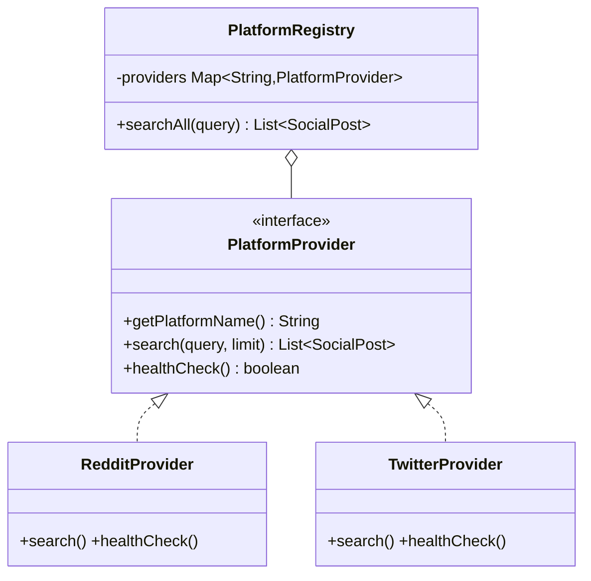
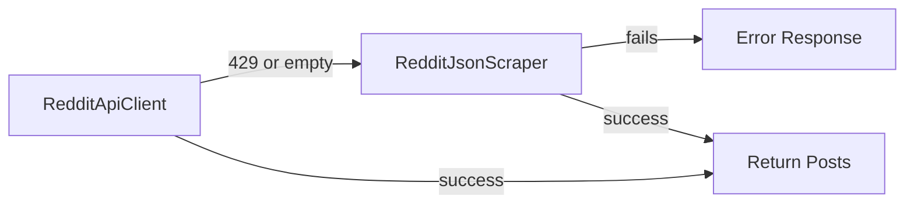
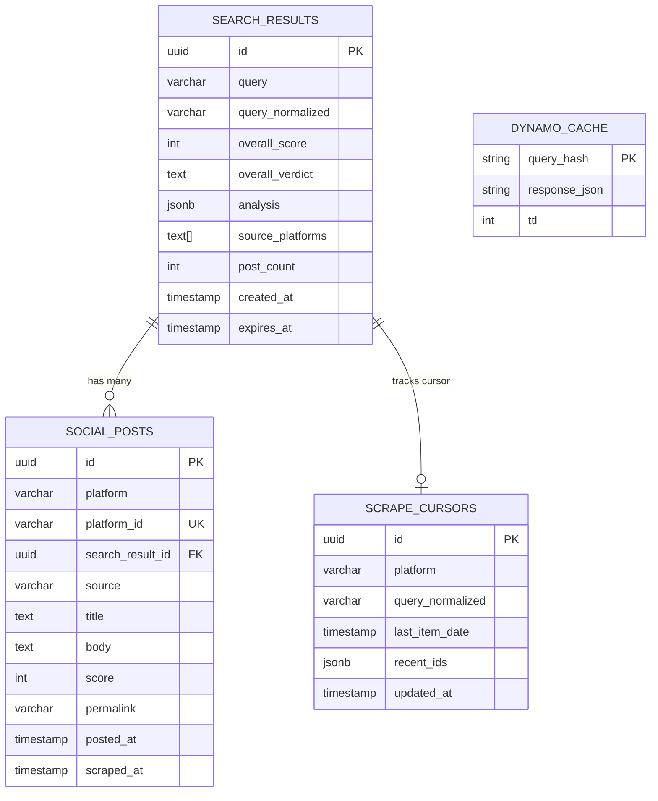
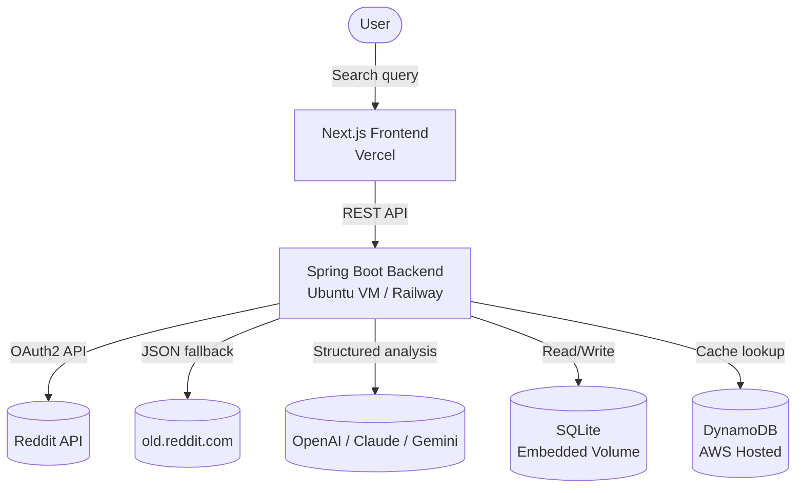
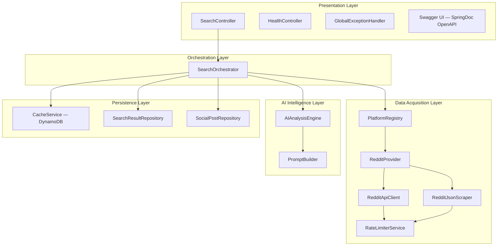
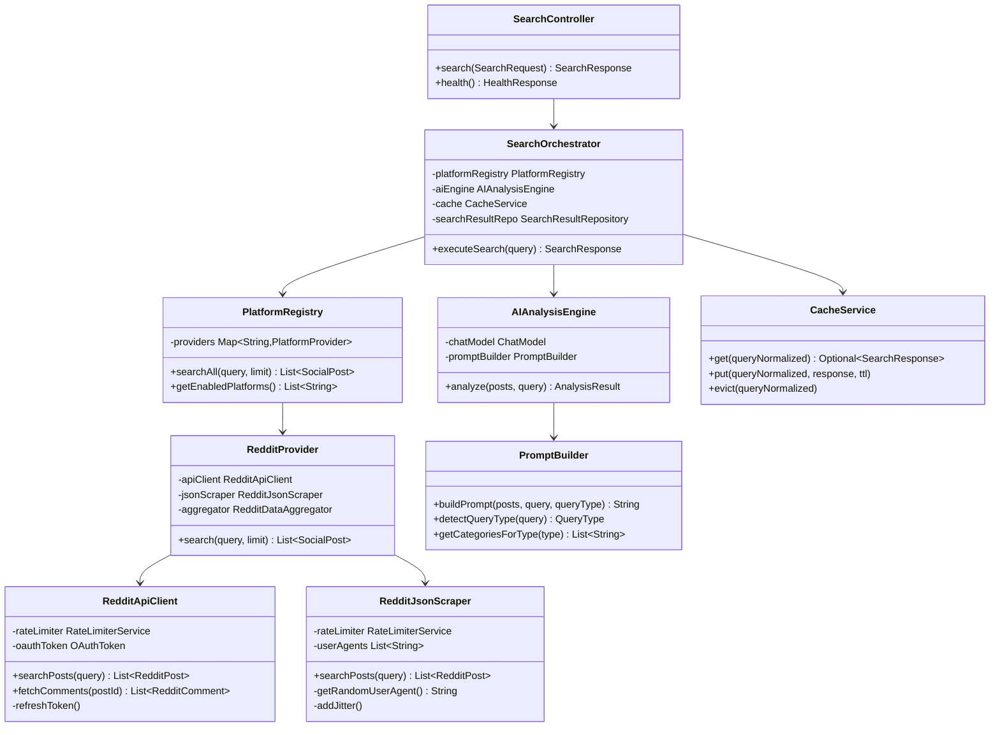
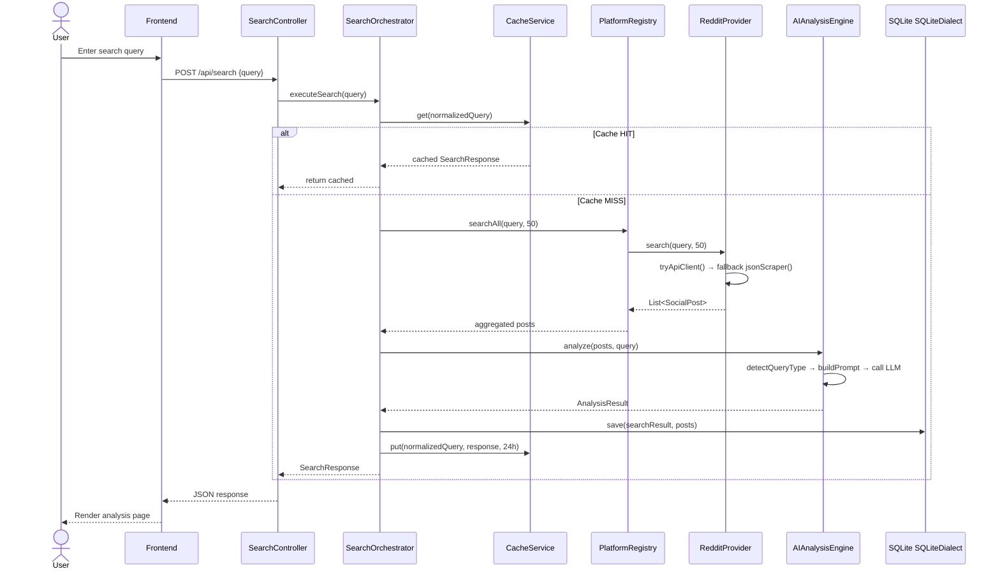
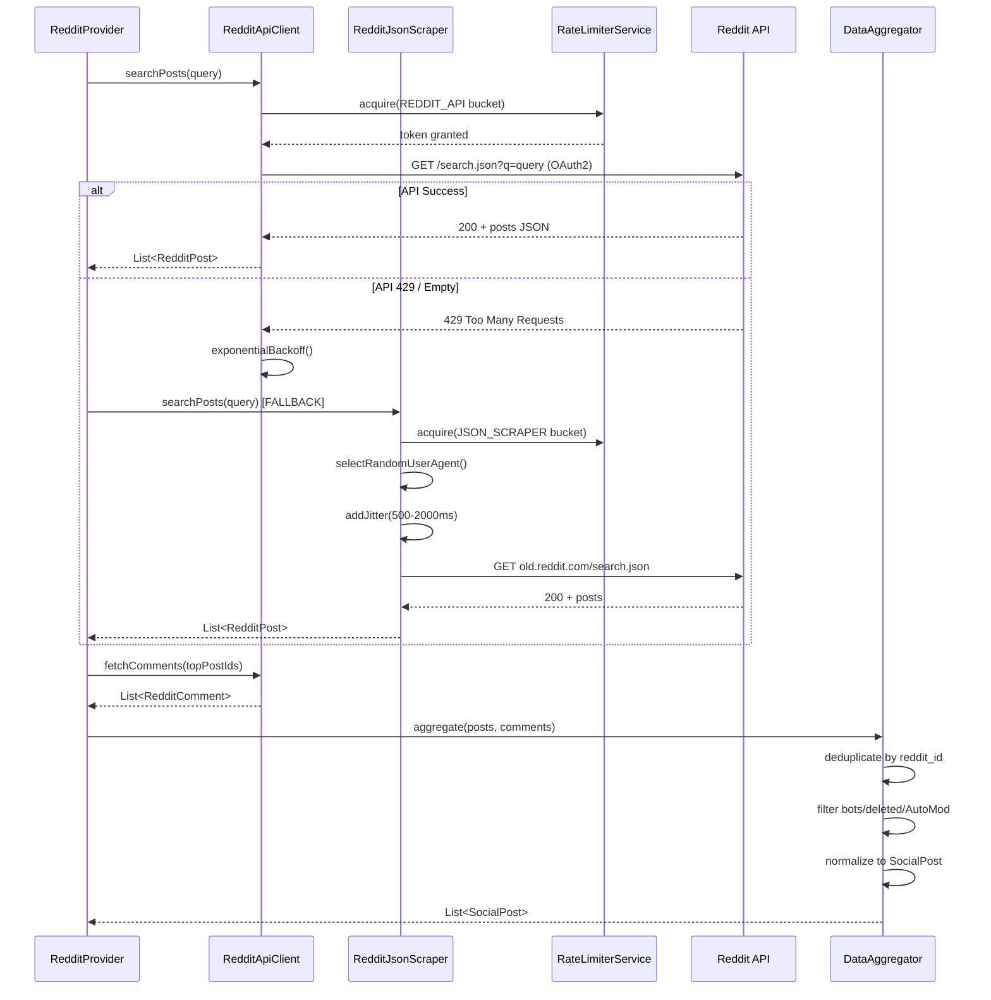

# CrowdLens — System Architecture

---

## 1. Design Principles

| Principle | How We Apply It |
|-----------|----------------|
| **Single Responsibility** | Each class does one thing: `RedditApiClient` fetches, `AIAnalysisEngine` analyzes, `CacheService` caches |
| **Open/Closed** | New platforms via `PlatformProvider` interface — extend, don't modify core |
| **Dependency Inversion** | Services depend on interfaces (`PlatformProvider`, `ChatModel`) not implementations |
| **Layered/N-Tier Architecture** | Controllers → Services → Providers/Repositories — dependencies point inward |
| **12-Factor App** | Config via env vars, stateless backend, backing services as attached resources |
| **Fail Gracefully** | Circuit breaker on Reddit API; partial results > no results |
| **API-First Documentation** | SpringDoc OpenAPI (Swagger UI) — interactive docs at `/swagger-ui.html` |

---

## 2. Design Patterns

### Strategy Pattern — Platform Providers
Each social platform is a swappable strategy. The `PlatformRegistry` delegates to whichever providers are enabled.



### Strategy Pattern — AI Providers
Spring AI's `ChatModel` interface — OpenAI, Anthropic, Gemini are all swappable implementations. Zero business logic changes.

### Template Method — Scraping Pipeline
Base scraping flow (rate-limit → fetch → filter → deduplicate → store) is fixed. Each platform overrides the `fetch` and `filter` steps.

```java
public abstract class BaseScraper {
    public final List<SocialPost> execute(String query) {
        rateLimiter.acquire();           // Fixed
        List<RawData> raw = fetch(query); // Platform-specific
        List<RawData> filtered = filter(raw); // Platform-specific
        List<SocialPost> deduped = deduplicate(filtered); // Fixed
        store(deduped);                  // Fixed
        return deduped;
    }
    protected abstract List<RawData> fetch(String query);
    protected abstract List<RawData> filter(List<RawData> raw);
}
```

### Chain of Responsibility — Reddit Data Acquisition
API Client → JSON Scraper → (future: Playwright). If one fails, the next tries.



### Circuit Breaker — External API Protection
Resilience4j circuit breaker wraps Reddit and OpenAI calls. Prevents cascade failures and respects rate limits.

```
States: CLOSED (normal) → OPEN (failing, skip calls) → HALF_OPEN (test recovery)
Config: Open after 5 failures in 60s, wait 30s before half-open
```

### Observer Pattern — Event-Driven Extensibility
Spring's `ApplicationEventPublisher` for decoupled side-effects:
- `SearchCompletedEvent` → log analytics, update trending
- `RateLimitHitEvent` → alert, switch to fallback scraper
- `AnalysisCompletedEvent` → cache result, update DB

---

## 3. Database Design

### 3.1 SQL vs NoSQL — Why SQLite?

| Criteria | SQLite (Relational) | PostgreSQL (SQL) | DynamoDB (NoSQL) |
|----------|:---:|:---:|:---:|
| **Structured analysis data** | ✅ JSON functions provide flexibility | ✅ JSONB gives NoSQL flexibility | ⚠️ Limited query patterns |
| **Complex queries** | ✅ JOIN, GROUP BY | ✅ JOIN, GROUP BY, full-text search | ❌ Single-table design required |
| **Resource Footprint** | ✅ **Extremely Low** (<10MB RAM) | ❌ High overhead (~200MB+ RAM) | ✅ Fully Managed APIs |
| **ACID transactions** | ✅ Full ACID | ✅ Full ACID | ⚠️ Transaction support limited |
| **Hosting Strategy** | ✅ Best for 1GB Ubuntu VM (OCI) | ⚠️ Too heavy for 1GB VM | ✅ AWS always-free |

**Verdict**: SQLite wins because:
- We are running the backend on a small **1GB Ubuntu Cloud VM** (Oracle OCI or Railway). PostgreSQL carries too much CPU/Memory overhead for this footprint.
- Our data is relational, but the scale per-user is small and easily handled by a robust embedded database. 
- Using Docker volumes (`/app/data`), we persist the `crowdlens.db` file securely without managing a separate heavy database server.

### 3.2 DynamoDB for Caching — Why Not PostgreSQL for Both?

| Concern | PostgreSQL as Cache | DynamoDB as Cache |
|---------|:---:|:---:|
| **Lookup speed** | ~5-10ms (query + index) | ~1-3ms (hash key) |
| **TTL auto-expiry** | ❌ Needs cron job / pg_cron | ✅ Native TTL — expired items auto-deleted |
| **Free tier** | 500MB (shared with app data) | 25GB + 200M req/mo (separate, always free) |
| **Access pattern** | Overkill — simple key-value lookup | ✅ Perfect fit — `queryHash → JSON` |

**Verdict**: DynamoDB is purpose-built for our cache pattern (key-value with TTL). Keeps cache isolated from app data, has vastly more free capacity, and auto-cleans expired entries.

### 3.3 Entity-Relationship Diagram



### 3.4 Table Schemas + Indexes

### 3.4 Table Schemas

*Note: Hibernate `ddl-auto: update` manages these schemas internally utilizing `SQLiteDialect`.*

```sql
-- Conceptual SQLite Schema

CREATE TABLE search_results (
    id              TEXT PRIMARY KEY,
    query           TEXT NOT NULL,
    query_normalized TEXT NOT NULL,
    overall_score   INTEGER,
    overall_verdict TEXT,
    analysis        TEXT NOT NULL,              -- JSON serialized
    source_platforms TEXT,                      -- Serialized array
    post_count      INTEGER DEFAULT 0,
    created_at      TIMESTAMP,
    expires_at      TIMESTAMP
);

CREATE TABLE social_posts (
    id              UUID PRIMARY KEY DEFAULT gen_random_uuid(),
    platform        VARCHAR(50) NOT NULL,         -- 'reddit', 'twitter'
    platform_id     VARCHAR(100) UNIQUE NOT NULL,  -- Dedup key
    search_result_id UUID REFERENCES search_results(id) ON DELETE CASCADE,
    source          VARCHAR(200),                  -- subreddit, hashtag
    title           TEXT,
    body            TEXT,
    score           INTEGER DEFAULT 0,
    permalink       VARCHAR(500),
    posted_at       TIMESTAMP,
    scraped_at      TIMESTAMP DEFAULT NOW()
);
CREATE INDEX idx_posts_platform ON social_posts(platform, platform_id);
CREATE INDEX idx_posts_search ON social_posts(search_result_id);

CREATE TABLE scrape_cursors (
    id              UUID PRIMARY KEY DEFAULT gen_random_uuid(),
    platform        VARCHAR(50) NOT NULL,
    query_normalized VARCHAR(500) NOT NULL,
    last_item_date  TIMESTAMP,
    recent_ids      JSONB DEFAULT '[]',            -- Last 100 IDs
    updated_at      TIMESTAMP DEFAULT NOW(),
    UNIQUE(platform, query_normalized)
);
CREATE INDEX idx_cursor_lookup ON scrape_cursors(platform, query_normalized);
```

```python
# DynamoDB Cache Table (AWS)
# Partition Key: query_hash (SHA-256 of normalized query)
# TTL attribute: expires_at (epoch seconds, auto-deleted by DynamoDB)
{
    "TableName": "crowdlens-cache",
    "KeySchema": [{"AttributeName": "query_hash", "KeyType": "HASH"}],
    "AttributeDefinitions": [{"AttributeName": "query_hash", "AttributeType": "S"}],
    "TimeToLiveSpecification": {"AttributeName": "expires_at", "Enabled": true}
}
```

---

## 4. High-Level Design (HLD)

### System Context



### Component Diagram



---

## 5. Low-Level Design (LLD)

### Class Diagram — Core Domain



### Sequence Diagram — Search Flow



### Sequence Diagram — Reddit Scraping Pipeline



---

## 6. Scraping Intelligence Strategy

*Adapted from [Matiks Monitor Scraping Intelligence](https://github.com/Krishnav1237/Social-Media-Brand-Monitoring/blob/main/docs/02_SCRAPING_INTELLIGENCE_AND_STRATEGY.md)*

### 5.1 Incremental Cursor (Avoid Duplicates)

**Problem**: Stateless scrapers refetch the same posts repeatedly → duplicates, wasted bandwidth, higher ban risk.

**Solution**: Track a "high water mark" per platform per query.

```java
@Entity
public class ScrapeCursor {
    private String platform;        // "reddit"
    private String queryNormalized; // "creatine supplement"
    private Instant lastItemDate;   // newest post timestamp seen
    private Set<String> recentIds;  // last 100 IDs (bloom filter style)
}
```

**Algorithm**:
1. Fetch latest batch of posts
2. For each post: is `post.date <= cursor.lastItemDate`?
   - **YES** → already seen territory → **STOP**
   - **NO** → process post, update cursor
3. Result: typical run fetches 1-2 pages instead of 10+

### 5.2 Adversarial Defense (Stealth)

| Technique | Implementation |
|-----------|---------------|
| **User-Agent rotation** | Pool of 10+ real browser UAs, rotated per request |
| **Request jitter** | `Thread.sleep(random(500, 2000))` between requests |
| **Exponential backoff** | On 429: 2s → 4s → 8s → 16s → 32s → 60s max |
| **Token bucket** | Bucket4j: 60 req/min (API), 20 req/min (JSON scraper) |
| **Circuit breaker** | Resilience4j: open after 5 failures/60s, 30s recovery |

### 5.3 Data Filtering

- Filter out `[deleted]`, `[removed]` posts
- Filter AutoModerator, known bot accounts
- Minimum content length: 20 characters
- Relevance scoring: posts mentioning query in title weighted 2x

### 5.4 Rate Limits Summary

| Source | Limit | Backoff | Max Concurrent |
|--------|-------|---------|----------------|
| Reddit OAuth2 API | 60/min (of 100 allowed) | Exponential 2^n | 1 |
| Reddit JSON endpoint | 20/min | Exponential 2^n | 1 |

---

## 7. Data Models

### Request/Response DTOs

```java
// Input
record SearchRequest(String query) {}

// Output
record SearchResponse(
    UUID id,
    String query,
    int overallScore,           // 0-100
    String overallVerdict,      // "Good not Great"
    String verdictSummary,      // 2-3 sentence AI summary
    List<CategoryAnalysis> categories,
    List<Testimonial> testimonials,
    PersonaAnalysis personaAnalysis,
    int postCount,
    List<String> sourcePlatforms,
    Instant analyzedAt
) {}

record CategoryAnalysis(
    String name,                // "Efficacy", "Safety"
    String rating,              // "Excellent", "Good", "Fair", "Poor"
    String summary,             // AI-generated paragraph
    List<String> highlights     // Key bullet points
) {}

record Testimonial(
    String text,                // Reddit quote
    String sentiment,           // "positive", "neutral", "negative"
    String source,              // "r/supplements"
    String platform,            // "reddit"
    String permalink
) {}

record PersonaAnalysis(
    String question,            // "Is this right for you?"
    List<PersonaFit> fits       // Who it's good/bad for
) {}
```

---

## 8. Reddit Account Safety

### Is Using "Script" Type App Safe?

**Yes, with proper precautions.** Here's why and how:

| Concern | Reality |
|---------|---------|
| **Account ban for API use?** | No — "script" apps are Reddit's **official, intended** method for personal API access |
| **Rate limit violations?** | Our 60 req/min is well under the 100 QPM limit — safe margin |
| **ToS compliance?** | We only **read** public data (search, comments) — no posting, voting, or scraping private content |

### Recommended Safety Measures

1. **Use a dedicated Reddit account** — Create a new account just for CrowdLens API access. If anything goes wrong, your personal account is untouched.
2. **Descriptive User-Agent** — Reddit requires: `platform:app_id:version (by /u/username)`. Good UAs get higher trust.
3. **Stay under limits** — Our 60 req/min (with Bucket4j) gives 40% headroom under the 100 QPM limit.
4. **No write operations** — Read-only access = lowest risk category.

> [!TIP]
> **Strong recommendation**: Create a fresh Reddit account (takes 30 seconds) and register a new "script" app on it. Use those credentials for CrowdLens. This isolates your personal account completely.
