# CrowdLens - System Architecture

## Overview

CrowdLens is a product opinion analysis engine that aggregates Reddit discussions and uses AI to produce structured, dynamic verdicts. The architecture is built for a **single VM** (4 vCPU / 24 GB RAM) and optimized for sequential processing, minimal memory footprint, and graceful degradation.

## Table of Contents

1. [High-Level Design (HLD)](#1-high-level-design-hld)
2. [System Topology](#2-system-topology)
3. [Low-Level Design (LLD)](#3-low-level-design-lld)
4. [Database Schema](#4-database-schema)
5. [Design Patterns](#5-design-patterns)
6. [Design Principles](#6-design-principles)
7. [API Contract](#7-api-contract)
8. [AI Subsystem](#8-ai-subsystem)
9. [Cache Architecture](#9-cache-architecture)
10. [Rate Limiting & Resilience](#10-rate-limiting--resilience)
11. [Key Design Decisions & Trade-offs](#11-key-design-decisions--trade-offs)
12. [Scalability & Bottlenecks](#12-scalability--bottlenecks)
13. [E2E Flow](#13-e2e-flow)
14. [Technology Deep-Dives](#14-technology-deep-dives)
15. [SQL vs NoSQL — Why Relational Here](#15-sql-vs-nosql--why-relational-here)

## 1. High-Level Design (HLD)

### System Context

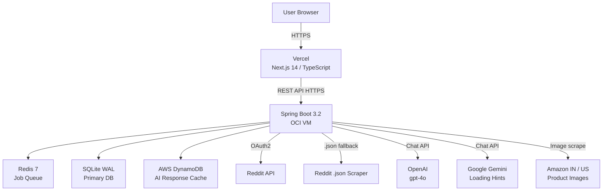
```mermaid
graph TD
    Browser["User Browser"] -->|HTTPS| Vercel["Vercel\nNext.js 14 / TypeScript"]
    Vercel -->|REST API HTTPS| Backend["Spring Boot 3.2\nOCI VM"]

    Backend --> Redis["Redis 7\nJob Queue"]
    Backend --> SQLite["SQLite WAL\nPrimary DB"]
    Backend --> DynamoDB["AWS DynamoDB\nAI Response Cache"]

    Backend -->|OAuth2| Reddit["Reddit API"]
    Backend -->|.json fallback| RedditScraper["Reddit .json Scraper"]
    Backend -->|Chat API| OpenAI["OpenAI\ngpt-4o"]
    Backend -->|Chat API| Gemini["Google Gemini\nLoading Hints"]
    Backend -->|Image scrape| Amazon["Amazon IN / US\nProduct Images"]
```

### Request Lifecycle: Two Paths

**Path A — Cache Hit (< 100ms)**

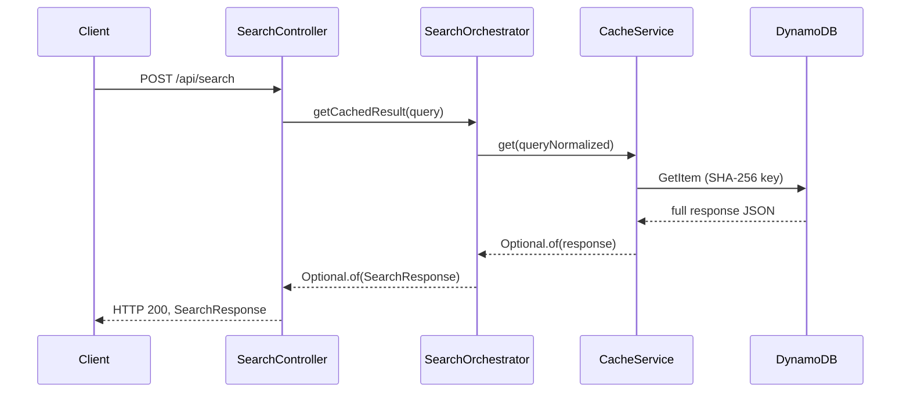
```mermaid
sequenceDiagram
    participant C as Client
    participant SC as SearchController
    participant SO as SearchOrchestrator
    participant CS as CacheService
    participant DDB as DynamoDB

    C->>SC: POST /api/search
    SC->>SO: getCachedResult(query)
    SO->>CS: get(queryNormalized)
    CS->>DDB: GetItem (SHA-256 key)
    DDB-->>CS: full response JSON
    CS-->>SO: Optional.of(response)
    SO-->>SC: Optional.of(SearchResponse)
    SC-->>C: HTTP 200, SearchResponse
```

**Path B — Cache Miss (15–60s, async)**

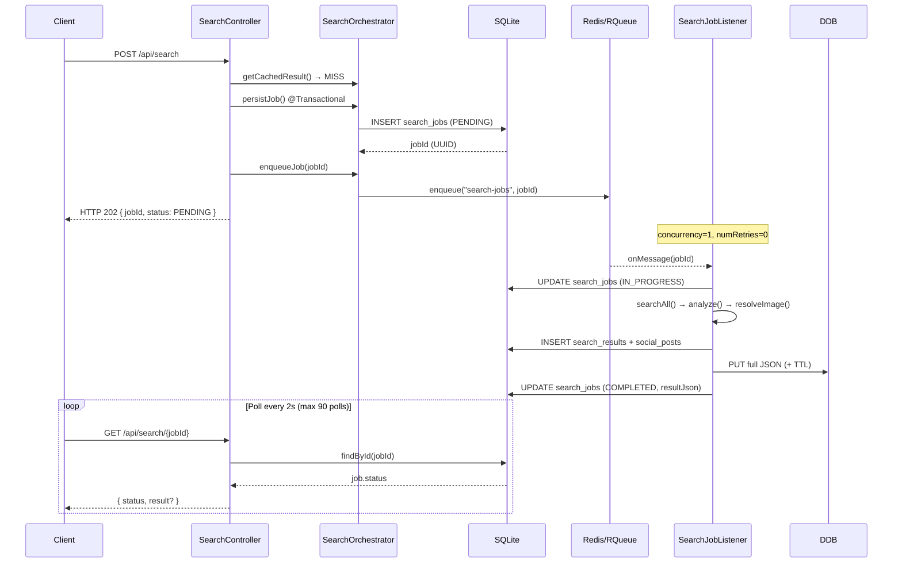
```mermaid
sequenceDiagram
    participant C as Client
    participant SC as SearchController
    participant SO as SearchOrchestrator
    participant DB as SQLite
    participant RQ as Redis/RQueue
    participant JL as SearchJobListener

    C->>SC: POST /api/search
    SC->>SO: getCachedResult() → MISS
    SC->>SO: persistJob() @Transactional
    SO->>DB: INSERT search_jobs (PENDING)
    DB-->>SO: jobId (UUID)
    SC->>SO: enqueueJob(jobId)
    SO->>RQ: enqueue("search-jobs", jobId)
    SC-->>C: HTTP 202 { jobId, status: PENDING }

    Note over JL: concurrency=1, numRetries=0
    RQ-->>JL: onMessage(jobId)
    JL->>DB: UPDATE search_jobs (IN_PROGRESS)
    JL->>JL: searchAll() → analyze() → resolveImage()
    JL->>DB: INSERT search_results + social_posts
    JL->>DDB: PUT full JSON (+ TTL)
    JL->>DB: UPDATE search_jobs (COMPLETED, resultJson)

    loop Poll every 2s (max 90 polls)
        C->>SC: GET /api/search/{jobId}
        SC->>DB: findById(jobId)
        DB-->>SC: job.status
        SC-->>C: { status, result? }
    end
```

## 2. System Topology

### Infrastructure Components

| Component | Technology | Role | Persistence |
|---|---|---|---|
| Frontend | Next.js 14 + Tailwind, Vercel | UI + share card | None (stateless) |
| Backend | Spring Boot 3.2, Java 17 | REST API + async worker | — |
| Job Queue | Redis 7 (no persistence) + RQueue | Decouple HTTP from slow pipeline | In-memory only |
| Primary DB | SQLite (WAL, `busy_timeout=5000ms`) | Job lifecycle + result index | Docker volume |
| AI Cache | AWS DynamoDB (PAY_PER_REQUEST) | Full AI response cache (TTL) | Permanent until TTL |
| Primary AI | OpenAI (configurable model: gpt-4o) | Product analysis, dynamic metrics | — |
| Secondary AI | Google Gemini (gemini-2.0-flash) | Loading hints only | — |
| Reddit | OAuth2 API + `.json` fallback | Source data collection | — |

### Docker Compose Network Flow

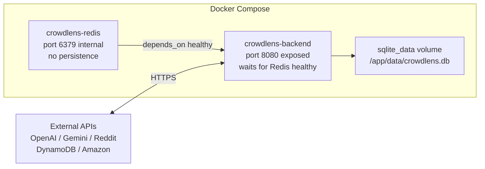
```mermaid
graph LR
    subgraph Docker["Docker Compose"]
        Redis["crowdlens-redis\nport 6379 internal\nno persistence"]
        Backend["crowdlens-backend\nport 8080 exposed\nwaits for Redis healthy"]
        Volume["sqlite_data volume\n/app/data/crowdlens.db"]
    end

    Redis -->|depends_on healthy| Backend
    Backend --> Volume

    Internet["External APIs\nOpenAI / Gemini / Reddit\nDynamoDB / Amazon"] <-->|HTTPS| Backend
```

**Redis DNS Config Note:** Lettuce (Spring Data Redis client) uses Netty's async DNS resolver by default, which breaks in Docker (sends UDP to `127.0.0.11:53`). `RedisConfig` forces JVM DNS resolution (`InetAddress` reads `/etc/resolv.conf`) instead.

## 3. Low-Level Design (LLD)

### Class Relationships

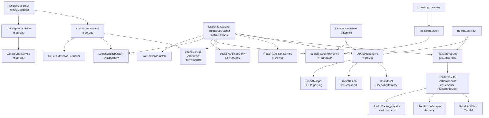
```mermaid
graph TD
    SC["SearchController\n@RestController"] --> SO["SearchOrchestrator\n@Service"]
    SC --> LHS["LoadingHintsService\n@Service"]
    LHS --> GCS["GeminiChatService\n@Service"]

    SO --> CS["CacheService\n@Service\n(DynamoDB)"]
    SO --> SJR["SearchJobRepository\n@Repository"]
    SO --> RME["RqueueMessageEnqueuer"]

    SJL["SearchJobListener\n@RqueueListener\nconcurrency=1"] --> PR["PlatformRegistry\n@Component"]
    SJL --> AIE["AIAnalysisEngine\n@Service"]
    SJL --> IRS["ImageResolutionService\n@Service"]
    SJL --> CS
    SJL --> SRR["SearchResultRepository\n@Repository"]
    SJL --> SPR["SocialPostRepository\n@Repository"]
    SJL --> SJR
    SJL --> TT["TransactionTemplate"]

    PR --> RP["RedditProvider\n@Component\nimplements PlatformProvider"]
    RP --> RAC["RedditApiClient\nOAuth2"]
    RP --> RJS["RedditJsonScraper\nfallback"]
    RP --> RDA["RedditDataAggregator\ndedup + rank"]

    AIE --> CM["ChatModel\nOpenAI @Primary"]
    AIE --> PB["PromptBuilder\n@Component"]
    AIE --> OM["ObjectMapper\nJSON parsing"]

    CompSvc["CompetitorService\n@Service"] --> SRR
    CompSvc --> AIE

    TC["TrendingController"] --> TS["TrendingService"] --> SRR
    HC["HealthController"] --> AIE
    HC --> PR
```

### Job State Machine

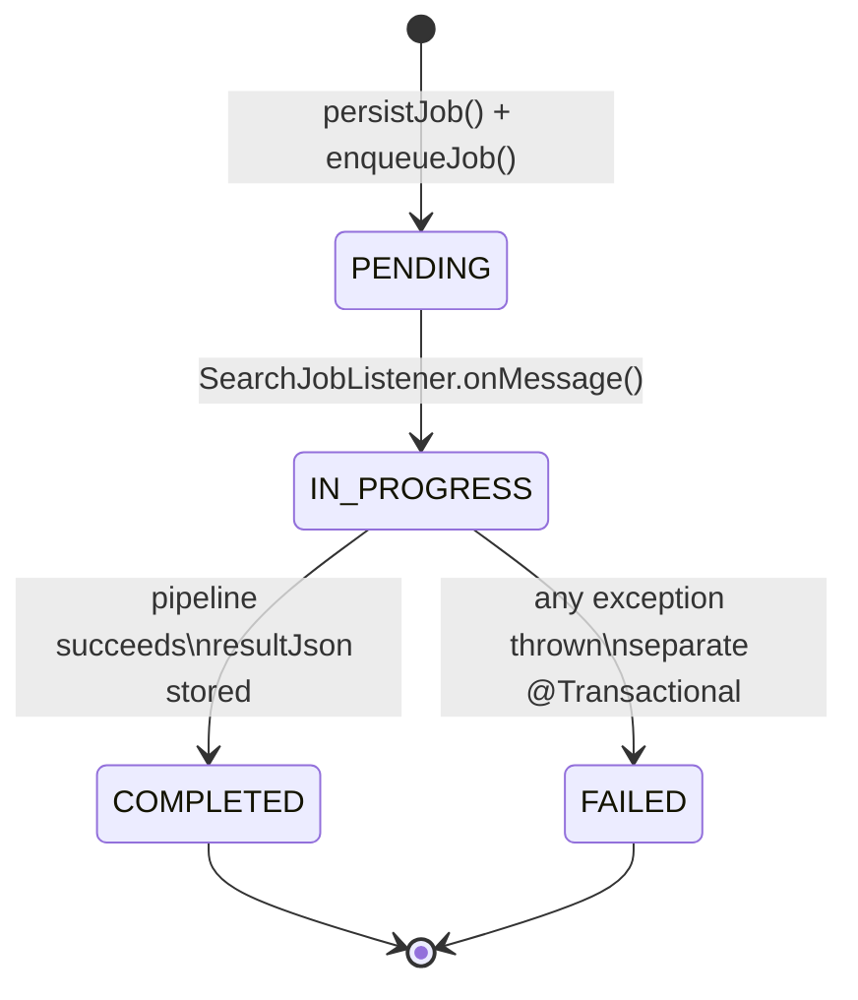
```mermaid
stateDiagram-v2
    [*] --> PENDING : persistJob() + enqueueJob()
    PENDING --> IN_PROGRESS : SearchJobListener.onMessage()
    IN_PROGRESS --> COMPLETED : pipeline succeeds\nresultJson stored
    IN_PROGRESS --> FAILED : any exception thrown\nseparate @Transactional
    COMPLETED --> [*]
    FAILED --> [*]
```

### Key Class Summaries

#### `SearchOrchestrator`
```java
// Three concerns, cleanly separated:
Optional<SearchResponse> getCachedResult(String query)  // fast path
UUID persistJob(SearchRequest request)                  // @Transactional — commits before enqueue
void enqueueJob(UUID jobId)                             // Redis publish AFTER commit
Optional<SearchJob> getJob(UUID jobId)                  // polling
Optional<SearchResponse> getResultForJob(SearchJob job) // deserialize stored result
```

#### `AIAnalysisEngine`
```java
// Uses @CircuitBreaker(name="openAi") — opens after 50% failure rate
AnalysisResult analyze(List<SocialPostDto> posts, String query)
// Fallback: AnalysisResult.error() — empty metrics prevent caching
AnalysisResult analyzeFallback(...)

// Lightweight: no Reddit data needed — used by CompetitorService
List<CompetitorSeed> suggestCompetitors(String product, String cat, String subCat)

HealthStatus healthCheck()  // "Reply with exactly: OK" ping
```

#### `AIAnalysisEngine.AnalysisResult` (Java Record)
```java
public record AnalysisResult(
    String productCategory,
    String productSubCategory,
    int overallScore,
    String verdictSentence,
    List<SearchResponse.Metric> metrics,       // 4 dynamic metrics
    List<String> positives,
    List<String> complaints,
    List<String> bestFor,
    List<String> avoid,
    List<SearchResponse.EvidenceSnippet> evidenceSnippets,
    String rawJson,
    List<CompetitorSeed> competitorSeeds,
    String productImageUrl
) {
    record CompetitorSeed(String name, int estimatedScore) {}
    static AnalysisResult empty(String query) { ... }   // no posts found
    static AnalysisResult error(String query, String msg) { ... } // AI failed
}
```

#### `CacheService` — Two Lookup Strategies
```java
// Layer 1: SHA-256 hash of normalized query → exact O(1) DynamoDB get
Optional<String> get(String queryNormalized)

// Layer 2: Full DynamoDB scan + Jaccard word-set similarity ≥ threshold
Optional<String> findSimilar(String queryNormalized)

void put(String queryNormalized, String responseJson)  // with TTL
void evict(String queryNormalized)
```

#### `CompetitorService` — Three-Tier Fallback
```java
// Tier 1: Jaccard similarity match from ALL SearchResult rows (threshold ≥ 0.3)
// Tier 2: Pad with exact category+subcategory match from SearchResult
// Tier 3: AI fallback — suggestCompetitors() → persist as placeholder rows
List<CompetitorDto> getCompetitors(String category, String subCategory,
                                    String productQuery, int limit)
```

#### `RedditProvider` — Chain of Responsibility
```java
// Step 1: OAuth2 API (higher quality, rate-limited, circuit-broken)
// Step 2: .json scraper (fallback, no auth, lower quality)
// Step 3: Aggregate + deduplicate (API preferred over scraper by platformId)
// Step 4: Rank by Reddit score, cap to limit
// Step 5: Fetch top 10 comments from best posts
List<SocialPostDto> search(String query, int limit, int maxComments)
```

#### `ImageResolutionService`
```java
// Amazon IN → Amazon US fallback → empty
Optional<String> fetchFromAmazon(String query)

// Download → validate size ≤ 512KB → base64 encode
// Result: "data:image/jpeg;base64,..."  (used by html2canvas in share card)
Optional<String> toBase64DataUri(String imageUrl)
```

## 4. Database Schema

### Entity-Relationship Diagram

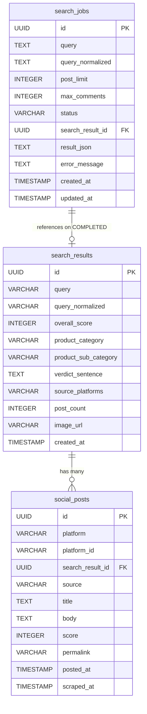
```mermaid
erDiagram
    search_jobs {
        UUID id PK
        TEXT query
        TEXT query_normalized
        INTEGER post_limit
        INTEGER max_comments
        VARCHAR status
        UUID search_result_id FK
        TEXT result_json
        TEXT error_message
        TIMESTAMP created_at
        TIMESTAMP updated_at
    }

    search_results {
        UUID id PK
        VARCHAR query
        VARCHAR query_normalized
        INTEGER overall_score
        VARCHAR product_category
        VARCHAR product_sub_category
        TEXT verdict_sentence
        VARCHAR source_platforms
        INTEGER post_count
        VARCHAR image_url
        TIMESTAMP created_at
    }

    social_posts {
        UUID id PK
        VARCHAR platform
        VARCHAR platform_id
        UUID search_result_id FK
        VARCHAR source
        TEXT title
        TEXT body
        INTEGER score
        VARCHAR permalink
        TIMESTAMP posted_at
        TIMESTAMP scraped_at
    }

    search_jobs ||--o| search_results : "references on COMPLETED"
    search_results ||--o{ social_posts : "has many"
```

### SQLite — `search_jobs`

| Column | Type | Constraints | Notes |
|---|---|---|---|
| `id` | UUID | PK, NOT NULL | Auto-generated UUID |
| `query` | TEXT | NOT NULL | Original user query |
| `query_normalized` | TEXT | NOT NULL | Lowercased, trimmed, collapsed whitespace |
| `post_limit` | INTEGER | NOT NULL | Stored as `post_limit` — `LIMIT` is SQL reserved word |
| `max_comments` | INTEGER | NOT NULL | Max comments per post |
| `status` | VARCHAR(20) | NOT NULL | `PENDING`, `IN_PROGRESS`, `COMPLETED`, `FAILED` |
| `search_result_id` | UUID | nullable | FK to `search_results.id` (set on COMPLETED) |
| `result_json` | TEXT | nullable | Full serialized `SearchResponse` — DynamoDB-independent |
| `error_message` | TEXT | nullable | Error details on FAILED |
| `created_at` | TIMESTAMP | NOT NULL | Set by `@PrePersist` |
| `updated_at` | TIMESTAMP | NOT NULL | Set by `@PrePersist` + `@PreUpdate` |

> **Why `result_json` on the job row?** Polling doesn't depend on DynamoDB availability or TTL expiry. The full response is always accessible from SQLite once COMPLETED.

### SQLite — `search_results`

| Column | Type | Constraints | Notes |
|---|---|---|---|
| `id` | UUID | PK | Auto-generated UUID |
| `query` | VARCHAR(500) | NOT NULL | Original query as typed |
| `query_normalized` | VARCHAR(500) | NOT NULL, **indexed** | Cache key + competitor exclusion |
| `overall_score` | INTEGER | nullable | 0–100, null for AI-seeded placeholders |
| `product_category` | VARCHAR(100) | nullable, **indexed** | e.g. "Grooming" |
| `product_sub_category` | VARCHAR(100) | nullable, **indexed** | e.g. "Electric Trimmer" |
| `verdict_sentence` | TEXT | nullable | Null for AI-seeded competitor placeholders |
| `source_platforms` | VARCHAR(300) | nullable | Comma-separated, e.g. "reddit" |
| `post_count` | INTEGER | nullable | Null for AI-seeded rows |
| `image_url` | VARCHAR(2048) | nullable | Resolved from Reddit or Amazon |
| `created_at` | TIMESTAMP | **indexed** | Recency ordering in competitor queries |

**Indexes:** `idx_search_query_norm`, `idx_search_created`, `idx_search_category`, `idx_search_subcategory`

> **Design Intent:** Permanent product index — rows are never deleted. AI-seeded placeholder rows have null `verdictSentence`, `sourcePlatforms`, `postCount`. When a user searches a seeded product, a real row is inserted with a newer `createdAt`; the competitor query picks `MAX(createdAt)` so real scores always win over estimates.

### SQLite — `social_posts`

| Column | Type | Constraints | Notes |
|---|---|---|---|
| `id` | UUID | PK | Auto-generated UUID |
| `platform` | VARCHAR(50) | NOT NULL | e.g. "reddit" |
| `platform_id` | VARCHAR(100) | NOT NULL, **UNIQUE** | Reddit post/comment ID — dedup key |
| `search_result_id` | UUID | FK (LAZY) | Links to `search_results.id` |
| `source` | VARCHAR(200) | — | Subreddit name |
| `title` | TEXT | — | Post title |
| `body` | TEXT | — | Post body or comment text |
| `score` | INTEGER | default 0 | Reddit upvote score |
| `permalink` | VARCHAR(500) | — | Full Reddit URL |
| `posted_at` | TIMESTAMP | — | Original post time |
| `scraped_at` | TIMESTAMP | default now | Set by `@PrePersist` |

**Indexes:** `idx_posts_platform` (platform, platformId), `idx_posts_search` (search_result_id)

### DynamoDB — `crowdlens-cache`

| Attribute | Type | Notes |
|---|---|---|
| `query_hash` | String (PK) | SHA-256 of normalized query |
| `query_normalized` | String | Used for Jaccard similarity scan |
| `response_json` | String | Full serialized `SearchResponse` JSON (~10 KB) |
| `expires_at` | Number | Unix epoch seconds — DynamoDB TTL attribute |
| `created_at` | String | ISO-8601 timestamp |

**Billing mode:** PAY_PER_REQUEST (no provisioned throughput needed).  
**TTL:** Configurable via `CACHE_TTL_HOURS` (default 24h). DynamoDB TTL deletion is eventual; `CacheService.get()` double-checks `expires_at` manually.  
**Table creation:** `CacheService` auto-creates the table at startup if `ResourceNotFoundException` is thrown (`ensureTableExists()`). App degrades gracefully if DynamoDB is unreachable.

## 5. Design Patterns

### Strategy Pattern — Platform Providers

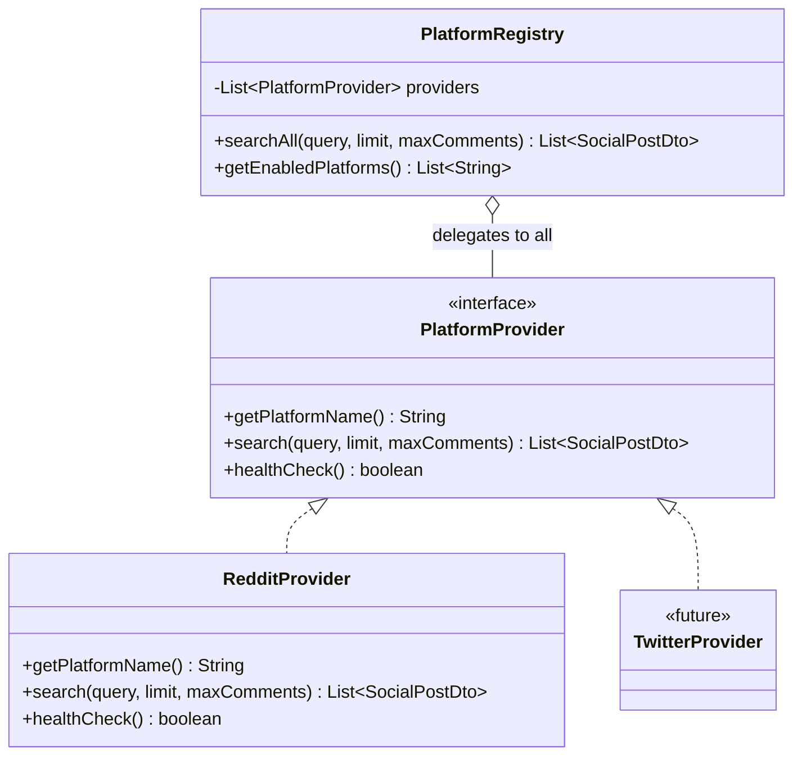
```mermaid
classDiagram
    class PlatformProvider {
        <<interface>>
        +getPlatformName() String
        +search(query, limit, maxComments) List~SocialPostDto~
        +healthCheck() boolean
    }

    class RedditProvider {
        +getPlatformName() String
        +search(query, limit, maxComments) List~SocialPostDto~
        +healthCheck() boolean
    }

    class TwitterProvider {
        <<future>>
    }

    class PlatformRegistry {
        -List~PlatformProvider~ providers
        +searchAll(query, limit, maxComments) List~SocialPostDto~
        +getEnabledPlatforms() List~String~
    }

    PlatformProvider <|.. RedditProvider
    PlatformProvider <|.. TwitterProvider
    PlatformRegistry o-- PlatformProvider : delegates to all
```

Adding a new data source = implement `PlatformProvider`, register as `@Component`. Zero changes to orchestration logic.

### Chain of Responsibility — Reddit Data Acquisition

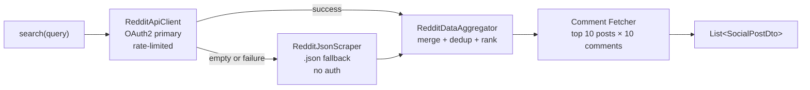
```mermaid
flowchart LR
    Q["search(query)"] --> A["RedditApiClient\nOAuth2 primary\nrate-limited"]
    A -->|success| AGG["RedditDataAggregator\nmerge + dedup + rank"]
    A -->|empty or failure| B["RedditJsonScraper\n.json fallback\nno auth"]
    B --> AGG
    AGG --> C["Comment Fetcher\ntop 10 posts × 10 comments"]
    C --> OUT["List&lt;SocialPostDto&gt;"]
```

Each handler either produces a result or passes to the next. Resilient to API failures without changing calling code.

### Observer Pattern — RQueue Listener


```mermaid
flowchart LR
    SC["SearchController\nPOST /api/search"] -->|enqueue message| Redis["Redis\nsearch-jobs queue"]
    Redis -->|"&#64;RqueueListener"| SJL["SearchJobListener\nconcurrency=1"]
    SC -.->|no direct reference| SJL
```

`SearchController` and `SearchJobListener` never reference each other — fully decoupled via the Redis broker.

### Builder Pattern — DTOs and Entities

All JPA entities (`SearchJob`, `SearchResult`, `SocialPost`) and DTOs (`SearchResponse`, `JobStatusResponse`) use Lombok `@Builder`:

```java
SearchResponse.builder()
    .productCategory(analysis.productCategory())
    .verdictSentence(analysis.verdictSentence())
    .metrics(analysis.metrics())
    ...
    .build();
```

### Factory Methods — `AnalysisResult` Sentinel Values

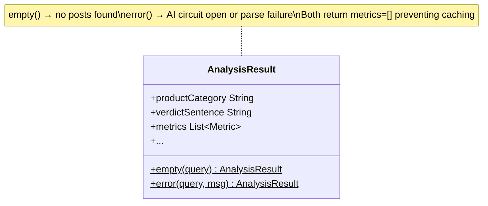
```mermaid
classDiagram
    class AnalysisResult {
        +productCategory String
        +verdictSentence String
        +metrics List~Metric~
        +...
        +empty(query)$ AnalysisResult
        +error(query, msg)$ AnalysisResult
    }

    note for AnalysisResult "empty() → no posts found\nerror() → AI circuit open or parse failure\nBoth return metrics=[] preventing caching"
```

Static factory methods encapsulate sentinel values. Downstream logic (`metrics != null && !metrics.isEmpty()`) works uniformly — no null checks scattered around.

### Template Method — `SearchJobListener.processJob()`

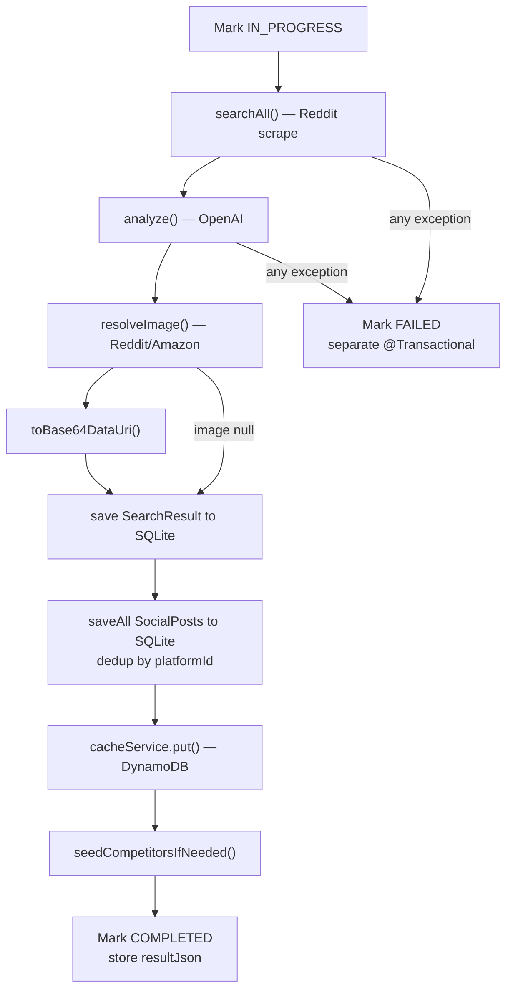
```mermaid
flowchart TD
    A["Mark IN_PROGRESS"] --> B["searchAll() — Reddit scrape"]
    B --> C["analyze() — OpenAI"]
    C --> D["resolveImage() — Reddit/Amazon"]
    D --> E["toBase64DataUri()"]
    E --> F["save SearchResult to SQLite"]
    F --> G["saveAll SocialPosts to SQLite\ndedup by platformId"]
    G --> H["cacheService.put() — DynamoDB"]
    H --> I["seedCompetitorsIfNeeded()"]
    I --> J["Mark COMPLETED\nstore resultJson"]

    B -->|any exception| ERR["Mark FAILED\nseparate @Transactional"]
    C -->|any exception| ERR
    D -->|image null| F
```

### Facade Pattern — `PlatformRegistry`

`SearchJobListener` calls `platformRegistry.searchAll()`. It has no knowledge of Reddit, OAuth2, scraping, or deduplication.

### Repository Pattern — Data Access

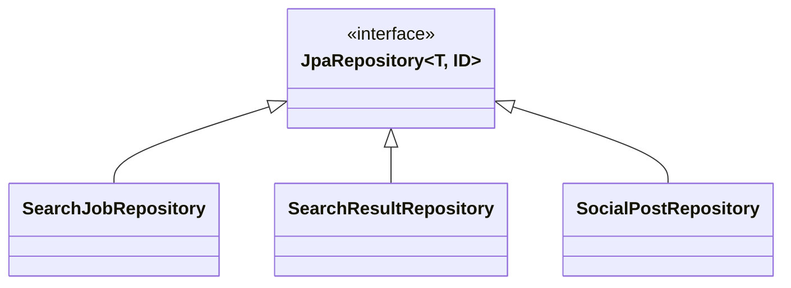
```mermaid
classDiagram
    class JpaRepository~T, ID~ {
        <<interface>>
    }
    class SearchJobRepository
    class SearchResultRepository
    class SocialPostRepository

    JpaRepository <|-- SearchJobRepository
    JpaRepository <|-- SearchResultRepository
    JpaRepository <|-- SocialPostRepository
```

Service layer never writes SQL directly. All DB access goes through typed repositories.

## 6. Design Principles

### SOLID Principles Applied

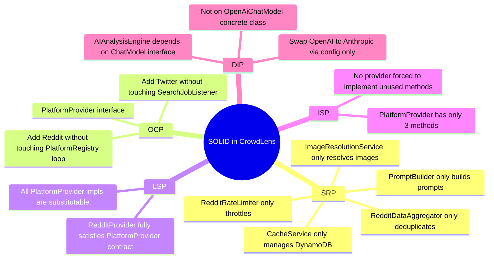
```mermaid
mindmap
  root((SOLID in CrowdLens))
    SRP
      PromptBuilder only builds prompts
      CacheService only manages DynamoDB
      ImageResolutionService only resolves images
      RedditRateLimiter only throttles
      RedditDataAggregator only deduplicates
    OCP
      PlatformProvider interface
      Add Twitter without touching SearchJobListener
      Add Reddit without touching PlatformRegistry loop
    LSP
      All PlatformProvider impls are substitutable
      RedditProvider fully satisfies PlatformProvider contract
    ISP
      PlatformProvider has only 3 methods
      No provider forced to implement unused methods
    DIP
      AIAnalysisEngine depends on ChatModel interface
      Not on OpenAiChatModel concrete class
      Swap OpenAI to Anthropic via config only
```

### Fail Fast + Graceful Degradation

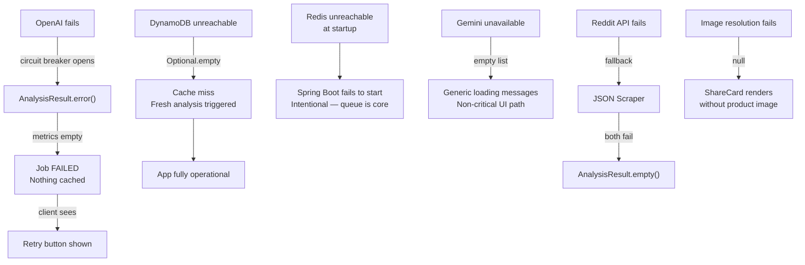
```mermaid
flowchart TD
    OAI["OpenAI fails"] -->|circuit breaker opens| AE["AnalysisResult.error()"]
    AE -->|metrics empty| FAIL["Job FAILED\nNothing cached"]
    FAIL -->|client sees| RETRY["Retry button shown"]

    DDB["DynamoDB unreachable"] -->|Optional.empty| MISS["Cache miss\nFresh analysis triggered"]
    MISS --> OK["App fully operational"]

    REDIS["Redis unreachable\nat startup"] --> CRASH["Spring Boot fails to start\nIntentional — queue is core"]

    GEM["Gemini unavailable"] -->|empty list| HINTS["Generic loading messages\nNon-critical UI path"]

    REDDIT["Reddit API fails"] -->|fallback| SCRAPER["JSON Scraper"]
    SCRAPER -->|both fail| EMPTY["AnalysisResult.empty()"]

    IMG["Image resolution fails"] -->|null| CARD["ShareCard renders\nwithout product image"]
```

### Idempotency

- `socialPostRepo.existsByPlatformId()` — re-running same query never duplicates posts
- `findTopByQueryNormalizedOrderByCreatedAtDesc` — prevents duplicate competitor placeholder rows

### Separation of Concerns: SQLite vs DynamoDB

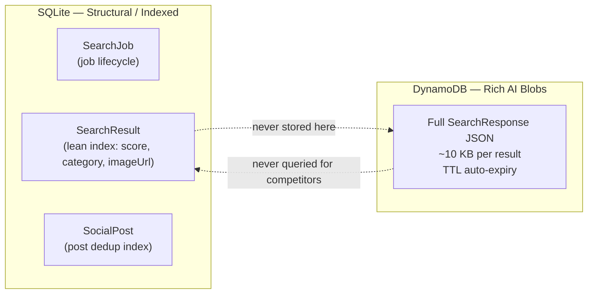
```mermaid
graph LR
    subgraph SQLite["SQLite — Structural / Indexed"]
        J["SearchJob\n(job lifecycle)"]
        SR["SearchResult\n(lean index: score, category, imageUrl)"]
        SP["SocialPost\n(post dedup index)"]
    end

    subgraph DDB["DynamoDB — Rich AI Blobs"]
        D["Full SearchResponse JSON\n~10 KB per result\nTTL auto-expiry"]
    end

    SR -.->|never stored here| D
    D -.->|never queried for competitors| SR
```

## 7. API Contract

### Endpoints

| Method | Path | Status Codes | Description |
|---|---|---|---|
| `POST` | `/api/search` | 200, 202, 400 | Submit search. 200=cache hit, 202=job queued |
| `GET` | `/api/search/{jobId}` | 200, 404 | Poll job status |
| `GET` | `/api/loading-hints?q={query}` | 200 | Gemini loading hints (degrades to empty) |
| `GET` | `/api/trending` | 200 | Recent high-score searches from SQLite |
| `GET` | `/api/health` | 200 | AI + platform health check |

### Polling Flow

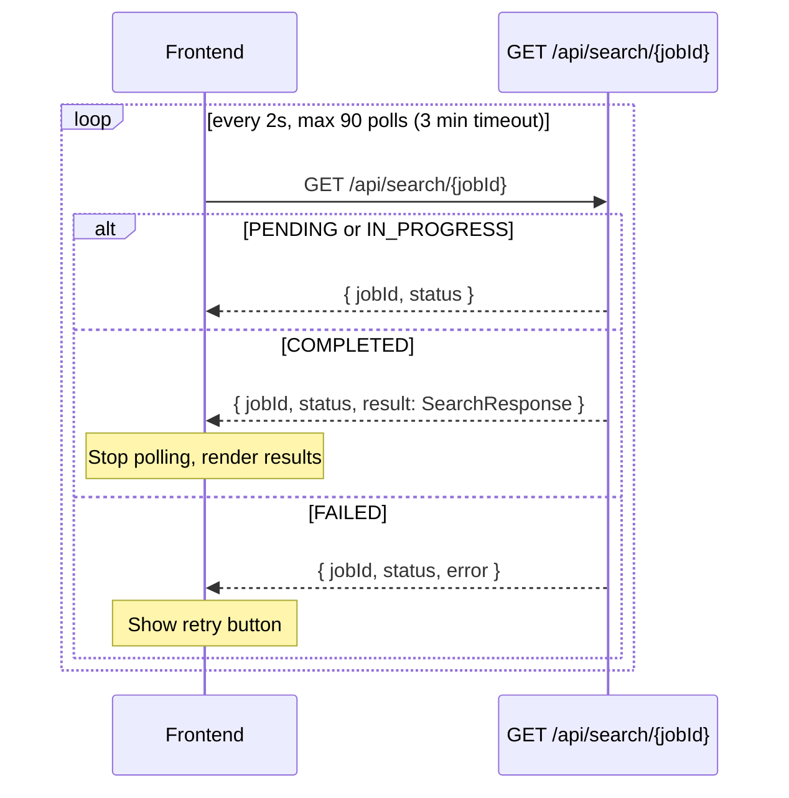
```mermaid
sequenceDiagram
    participant FE as Frontend
    participant API as GET /api/search/{jobId}

    loop every 2s, max 90 polls (3 min timeout)
        FE->>API: GET /api/search/{jobId}
        alt PENDING or IN_PROGRESS
            API-->>FE: { jobId, status }
        else COMPLETED
            API-->>FE: { jobId, status, result: SearchResponse }
            Note over FE: Stop polling, render results
        else FAILED
            API-->>FE: { jobId, status, error }
            Note over FE: Show retry button
        end
    end
```

### `POST /api/search` — Request

```json
{
  "query": "JBL Flip 6",
  "limit": 10,          // optional, default 10
  "maxComments": 50     // optional, default 50
}
```

Validation: `@Valid` — query must not be blank.

### `SearchResponse` Schema

```json
{
  "id": "UUID",
  "query": "string",
  "productCategory": "string | null",
  "productSubCategory": "string | null",
  "overallScore": 84,
  "verdictSentence": "string",
  "metrics": [
    { "label": "Battery Life", "score": 8.7, "explanation": "..." }
  ],
  "positives": ["string"],
  "complaints": ["string"],
  "bestFor": ["string"],
  "avoid": ["string"],
  "evidenceSnippets": [
    { "text": "...", "source": "r/audiophile", "permalink": "https://..." }
  ],
  "productImageUrl": "string | null",
  "productImageBase64": "string | null",
  "competitors": [
    { "name": "...", "overallScore": 78, "isReal": true, "verdictSentence": "..." }
  ],
  "postCount": 20,
  "sourcePlatforms": ["reddit"],
  "analyzedAt": "2026-04-28T08:00:00Z",
  "cached": false
}
```

Null fields are omitted from JSON (`@JsonInclude(NON_NULL)`).

## 8. AI Subsystem

### Prompt Architecture (10 Steps)

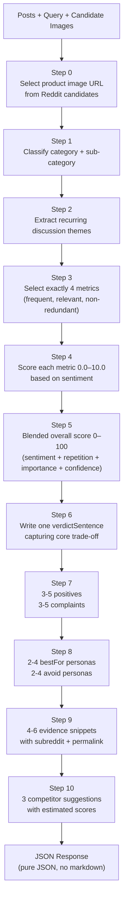
```mermaid
flowchart TD
    IN["Posts + Query + Candidate Images"] --> S0["Step 0\nSelect product image URL\nfrom Reddit candidates"]
    S0 --> S1["Step 1\nClassify category + sub-category"]
    S1 --> S2["Step 2\nExtract recurring discussion themes"]
    S2 --> S3["Step 3\nSelect exactly 4 metrics\n(frequent, relevant, non-redundant)"]
    S3 --> S4["Step 4\nScore each metric 0.0–10.0\nbased on sentiment"]
    S4 --> S5["Step 5\nBlended overall score 0–100\n(sentiment + repetition + importance + confidence)"]
    S5 --> S6["Step 6\nWrite one verdictSentence\ncapturing core trade-off"]
    S6 --> S7["Step 7\n3-5 positives\n3-5 complaints"]
    S7 --> S8["Step 8\n2-4 bestFor personas\n2-4 avoid personas"]
    S8 --> S9["Step 9\n4-6 evidence snippets\nwith subreddit + permalink"]
    S9 --> S10["Step 10\n3 competitor suggestions\nwith estimated scores"]
    S10 --> OUT["JSON Response\n(pure JSON, no markdown)"]
```

**Context window management:** Posts truncated to 400 chars each, max 60 posts sent.

### Blended Scoring Formula (Step 5)

Not a simple average — the AI blends four axes:

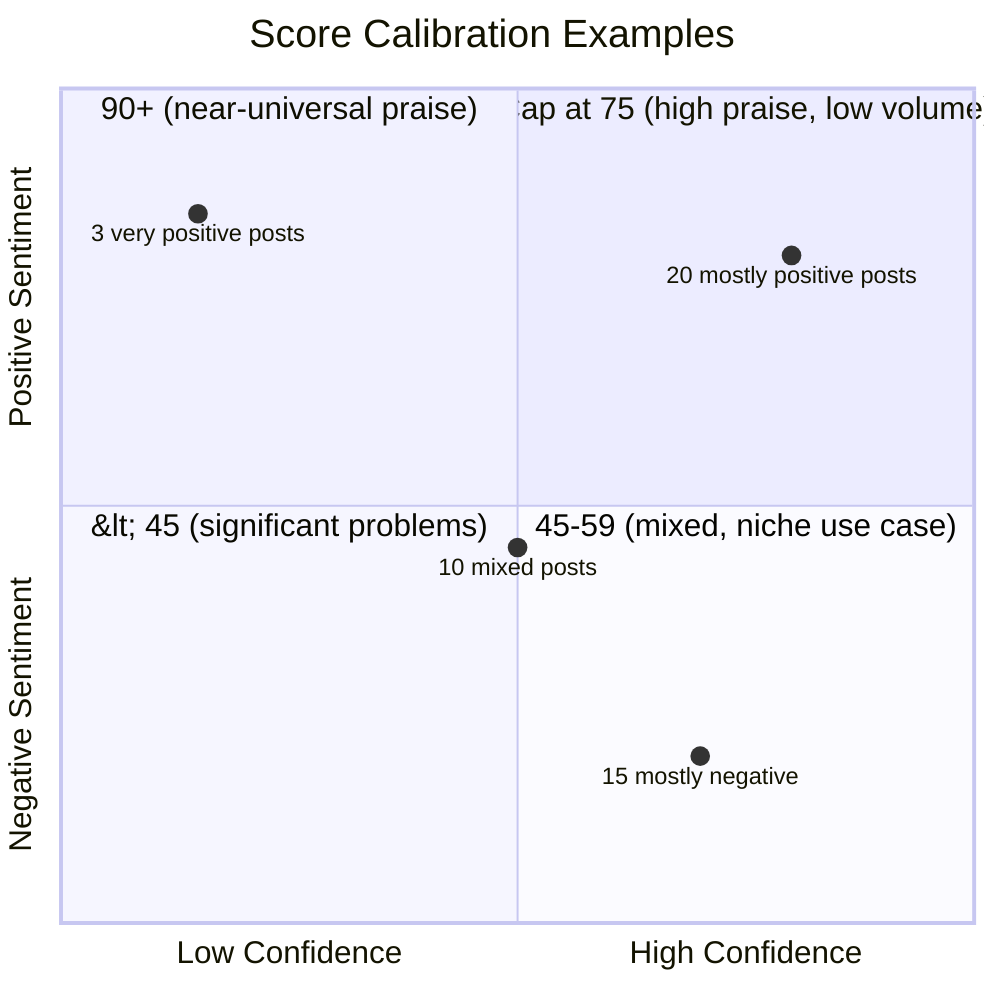
```mermaid
quadrantChart
    title Score Calibration Examples
    x-axis Low Confidence --> High Confidence
    y-axis Negative Sentiment --> Positive Sentiment
    quadrant-1 "Cap at 75 (high praise, low volume)"
    quadrant-2 "90+ (near-universal praise)"
    quadrant-3 "< 45 (significant problems)"
    quadrant-4 "45-59 (mixed, niche use case)"
    "3 very positive posts": [0.15, 0.85]
    "20 mostly positive posts": [0.8, 0.8]
    "10 mixed posts": [0.5, 0.45]
    "15 mostly negative": [0.7, 0.2]
```

| Factor | Description |
|---|---|
| Sentiment balance | Ratio of positive to negative opinions |
| Repetition strength | How frequently a theme appears across posts |
| Decision importance | Are complaints deal-breakers or minor? |
| Confidence volume | Cap at 75 if only 3 posts; higher volume = higher ceiling |

### Circuit Breaker Behavior

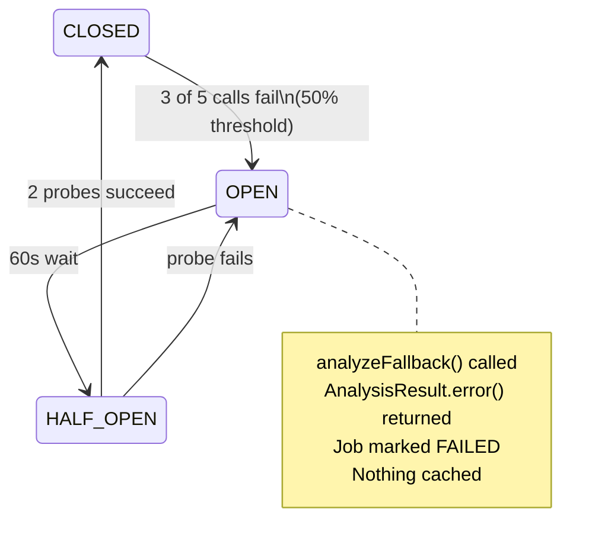
```mermaid
stateDiagram-v2
    CLOSED --> OPEN : 3 of 5 calls fail\n(50% threshold)
    OPEN --> HALF_OPEN : 60s wait
    HALF_OPEN --> CLOSED : 2 probes succeed
    HALF_OPEN --> OPEN : probe fails

    note right of OPEN
        analyzeFallback() called
        AnalysisResult.error() returned
        Job marked FAILED
        Nothing cached
    end note
```

### Model Agnosticism

`AIAnalysisEngine` injects `ChatModel` (Spring AI interface) with `@Qualifier("openAiChatModel")`. Swapping models:
```yaml
# application.yml — change model only
spring.ai.openai.chat.options.model: gpt-4o-mini  # or gpt-4-turbo
```
Or swap to Anthropic/Ollama by changing the Spring AI dependency and qualifier — zero Java changes.

### JSON Parsing Strategy

The AI is instructed to return pure JSON (no markdown). In practice, some models wrap output in ` ```json ` fences. `AIAnalysisEngine.parseAiResponse()` strips fences first:
```java
if (json.contains("```")) {
    json = json.replaceAll("(?s)```\\w*\\n?", "").replaceAll("```", "");
}
```

Each sub-array is parsed defensively — missing or non-array nodes return `Collections.emptyList()`, not an exception.

## 9. Cache Architecture

### Three-Level Cache Stack

```mermaid
flowchart TD
    Q["Incoming query"] --> L1{"Level 1\nDynamoDB Exact\nSHA-256 hash lookup\nO(1)"}
    L1 -->|HIT| R1["HTTP 200\nfull result\n< 100ms"]
    L1 -->|MISS| L2{"Level 2\nDynamoDB Jaccard Scan\nword-set similarity ≥ 0.75\nUsed by CompetitorService"}
    L2 -->|HIT| R2["HTTP 200\nsimilar result"]
    L2 -->|MISS| L3["Level 3: Cold\nRQueue Job\n15–60s pipeline"]
    L3 --> R3["HTTP 202 + jobId\npolling begins"]
    R3 -->|on COMPLETED| STORE["Stored in DynamoDB\n+ SQLite resultJson"]
```

### Cache Invalidation Strategy

- **No manual invalidation** (by design) — TTL-based expiry only
- **TTL:** configurable (default 24h) stored as Unix epoch in `expires_at`
- **DynamoDB TTL** is eventual (items may linger up to 48h past expiry) — `CacheService.get()` does a manual `Instant.now() > expiresAt` check before returning
- **Failed AI results are never cached** — `metrics != null && !metrics.isEmpty()` gate ensures partial/error results aren't served from cache

### Query Normalization

Cache key consistency relies on normalization:
```java
query.trim().toLowerCase(Locale.ROOT).replaceAll("\\s+", " ")
```
`"  Philips TRIMMER  "` → `"philips trimmer"`  
`"bluetooth Speaker portable"` → `"bluetooth speaker portable"`

## 10. Rate Limiting & Resilience

### Rate Limiting (Bucket4j Token Bucket)

```mermaid
graph LR
    subgraph Buckets["Bucket4j Token Buckets"]
        B1["Reddit OAuth2 API\n60 tokens / 60s\ncapacity: 60"]
        B2["Reddit .json Scraper\n20 tokens / 60s\ncapacity: 20"]
    end

    RAC["RedditApiClient\ncalls"] -->|consumes 1 token| B1
    RJS["RedditJsonScraper\ncalls"] -->|consumes 1 token| B2
```

Token bucket: each request consumes 1 token. Bursts up to capacity are allowed; sustained throughput is limited to refill rate.

### Circuit Breakers (Resilience4j)

| Breaker | Window | Threshold | Wait | Half-open probes |
|---|---|---|---|---|
| `redditApi` | 10 calls (count) | 50% failure | 30s | 3 |
| `openAi` | 5 calls (count) | 50% failure | 60s | 2 |
| `gemini` | 5 calls (count) | 50% failure | 60s | 2 |

### Tomcat Thread Pool

```yaml
server.tomcat.threads.max: 10
server.tomcat.threads.min-spare: 2
server.tomcat.accept-count: 5
```

Since long-running work is offloaded to RQueue, HTTP threads free immediately after returning 202. Max 10 threads handles concurrent polling easily.

### Redis No-Persistence Mode

```bash
redis-server --save "" --appendonly no
```

Redis is a pure in-memory job queue. A Redis restart loses in-flight jobs (they become zombie `PENDING` entries in SQLite). Acceptable — the user retries. No ops intervention needed.

## 11. Key Design Decisions & Trade-offs

```mermaid
graph TD
    D1["1. Async over Sync\nHTTP 202 + polling\nvs synchronous 60s wait"]
    D2["2. SQLite over PostgreSQL\nzero-ops single file\nvs managed DB overhead"]
    D3["3. resultJson on SearchJob\nDynamoDB-independent polling\nvs pure DynamoDB dependency"]
    D4["4. Dynamic Metrics\n4 AI-selected per product\nvs fixed category templates"]
    D5["5. DynamoDB for AI JSON\nTTL + no schema migrations\nvs SQLite BLOB storage"]
    D6["6. concurrency=1\n1 job at a time\nvs parallel workers"]
    D7["7. Two-step persistJob→enqueueJob\nprevents race condition\nvs single transaction"]
    D8["8. Image Base64 at analysis time\nCORS-safe share card\nvs proxying at render time"]
```

### 1. Async over Sync for Analysis

**Decision:** HTTP request returns 202 with a jobId; result is polled.

**Why:** Reddit scraping + OpenAI takes 15–60 seconds. Synchronous would hit Vercel's 30s timeout, block Tomcat threads, and show a blank screen with no updates.

**Trade-off:** Adds complexity (job state machine, polling, `resultJson` storage). Mitigated by keeping the state machine simple (4 states).

### 2. SQLite over PostgreSQL

**Decision:** Single SQLite file in WAL mode, `maximum-pool-size: 1`.

**Why:** Zero-ops. WAL mode with `busy_timeout=5000ms` handles one-writer-many-readers safely. `concurrency=1` on the listener means at most 1 writer at a time.

**Trade-off:** Not horizontally scalable. A second VM instance would fight over the file. Acceptable — single-instance is intentional.

### 3. `resultJson` on `SearchJob` Row

**Decision:** Store full `SearchResponse` on the job row in SQLite in addition to DynamoDB.

**Why:** `GET /api/search/{jobId}` must return a result even if DynamoDB TTL has expired or DynamoDB is temporarily unavailable.

**Trade-off:** Redundant storage (~10 KB per job). SQLite job rows can be periodically pruned once `COMPLETED`.

### 4. Dynamic Metrics (No Hardcoded Categories)

**Decision:** AI selects 4 product-specific metrics per query.

**Why:** A pressure cooker and a running shoe share zero relevant metrics. Fixed categories like "Efficacy", "Value", "Quality" are meaningless for purchase decisions.

**Trade-off:** AI must select good metrics. Mitigated by explicit Step 3 criteria in the prompt: frequently mentioned, buying-relevant, non-redundant, category-specific.

### 5. DynamoDB for AI JSON (Not SQLite BLOB)

**Decision:** Full AI response → DynamoDB. SQLite holds only the lean index row.

**Why:** AI JSON is ~10 KB per result. Storing BLOBs in SQLite would balloon a file that also holds job state. DynamoDB TTL auto-expiry eliminates cleanup jobs.

**Trade-off:** Two storage systems. Clear rule: structural/indexed = SQLite, rich AI output = DynamoDB.

### 6. `concurrency=1` on RQueue Listener

**Decision:** One job runs at a time.

**Why:** Each job: Reddit HTTP + OpenAI API + Amazon image scrape + SQLite writes. Parallel jobs risk SQLite lock contention, faster OpenAI quota exhaustion, and memory pressure.

**Trade-off:** Sequential queue. Acceptable at this scale; typical queue depth is 0–2.

### 7. Two-Step `persistJob` → `enqueueJob`

**Decision:** `persistJob()` is `@Transactional` and commits before `enqueueJob()` publishes to Redis.

**Why:** If `enqueueJob()` were inside the same transaction and the listener dequeued before the transaction committed, `searchJobRepo.findById()` in the listener would return `null` and discard the message silently.

**Fix:** `SearchController` calls `persistJob()` (commits), then `enqueueJob()` (Redis publish). Job row is guaranteed visible by the time the Redis message arrives.

### 8. Image Base64 Encoding at Analysis Time

**Decision:** Encode product image to base64 data URI during the background job, store in DynamoDB.

**Why:** `html2canvas` (share card PNG export) cannot render cross-origin `` URLs. Images from `i.redd.it` or Amazon CDN fail CORS checks in the browser Canvas API.

**Trade-off:** Adds ~10–20 KB to the cached response blob. Max image size capped at 512 KB to prevent runaway encoding.

## 12. Scalability & Bottlenecks

### Bottleneck Map

```mermaid
graph LR
    subgraph Current["Current Bottlenecks"]
        B1["OpenAI latency\n15–45s per job"]
        B2["Reddit rate limits\n60 req/min OAuth2"]
        B3["SQLite single writer\nall job writes serialized"]
        B4["DynamoDB Jaccard scan\nfull table scan – not on hot path"]
        B5["Amazon image scrape\n4s timeout per job"]
    end

    subgraph Mitigations["Mitigations"]
        M1["Async job → no user wait"]
        M2["Bucket4j + .json scraper fallback"]
        M3["concurrency=1 → 1 writer guaranteed"]
        M4["Not called per request – CompetitorService only"]
        M5["Graceful null if fails"]
    end

    B1 --> M1
    B2 --> M2
    B3 --> M3
    B4 --> M4
    B5 --> M5
```

### Scaling Path

```mermaid
graph TD
    NOW["Current: Single VM\nSQLite + Redis + Spring Boot"] 

    NOW -->|"Step 1: High job volume"| S1["Migrate to PostgreSQL\nFlyway V1 migration\nconfig-only change"]
    S1 -->|"Step 2: Horizontal workers"| S2["Multiple Spring Boot instances\nsame Redis queue\nPostgreSQL shared state"]
    S2 -->|"Step 3: Cache at scale"| S3["DynamoDB GSI or\nElasticSearch for\nJaccard similarity"]
    S3 -->|"Step 4: Redis reliability"| S4["Enable AOF persistence\nor Redis Cloud"]
```

### What Scales Well Already

- **Cache hit path** — 1 DynamoDB `GetItem`, returns < 100ms. Stateless Spring Boot scales horizontally once SQLite is replaced.
- **Frontend** — Vercel CDN, globally distributed, zero backend contact for static assets.
- **Competitor seeding** — SQLite competitor index is write-once, read-many. Competitor card never touches DynamoDB.
- **AI model swap** — Zero code changes. Config-only via `application.yml`.

## 13. E2E Flow

> This section is intentionally written for someone who knows how HTTP works but is new to async architectures, message queues, and AI pipelines.

### What Happens When You Search for "JBL Flip 6"

#### Step 1: You Type and Hit Search (The Frontend)

You're using a Next.js app hosted on Vercel. When you type a query and hit Search, the JavaScript in the browser does:

```typescript
const response = await fetch('https://crowdlens-api.anubhavbagri.com/api/search', {
  method: 'POST',
  body: JSON.stringify({ query: 'JBL Flip 6', limit: 10 })
});
```

This is a plain HTTPS POST to the Spring Boot backend. The frontend and backend are completely separate deployments — Vercel handles the UI, the OCI VM handles the API.

#### Step 2: The Backend Gets the Request (`SearchController`)

The first thing it does: **"Have we seen this query before?"**

It normalizes the query (`"JBL Flip 6"` → `"jbl flip 6"`) and hashes it with SHA-256. It then does a single DynamoDB `GetItem` call.

**Cache HIT → HTTP 200:** DynamoDB returns the full JSON. Response is back in < 100ms. Frontend renders immediately.

**Cache MISS → HTTP 202:** Creates a `SearchJob` in SQLite (`PENDING`), sends a message to Redis, returns `{ jobId, status: "PENDING" }`. Frontend starts polling.

```mermaid
flowchart LR
    FE["Frontend"] -->|POST /api/search| SC["SearchController"]
    SC -->|SHA-256 lookup| DDB["DynamoDB"]
    DDB -->|HIT| R200["HTTP 200\nFull result instantly"]
    DDB -->|MISS| PERSIST["Write SearchJob to SQLite\nstatus=PENDING"]
    PERSIST -->|enqueue| REDIS["Redis queue\nsearch-jobs"]
    REDIS --> R202["HTTP 202\n{ jobId, PENDING }"]
```

#### Step 3: The Frontend Polls

The frontend polls `GET /api/search/{jobId}` every 2 seconds, max 90 times (3 minutes):

```typescript
while (attempts < 90) {
  await sleep(2000);
  const { status, result } = await fetch(`/api/search/${jobId}`).then(r => r.json());
  if (status === 'COMPLETED') { renderResults(result); break; }
  if (status === 'FAILED')    { showRetryButton(); break; }
  updateLoadingMessage(); // PENDING / IN_PROGRESS
}
```

While waiting, Gemini generates contextual hints: *"Scanning r/audiophile for JBL speaker opinions…"* via `GET /api/loading-hints?q=JBL+Flip+6`.

#### Step 4: The Background Worker (`SearchJobListener`)

A thread on the server is permanently listening to the Redis queue. It picks up the job and runs the pipeline:

**4a. Reddit Scraping (~15–30s)**
```
Try: Reddit OAuth2 API  → 10 posts + top comments
Fallback: .json scraper → if OAuth fails
Filter: bots, deleted, AutoModerator
Dedup: by platformId (Reddit's native post ID)
```

**4b. OpenAI Analysis (~10–20s)**
```
Sends all post text to OpenAI with a structured prompt
AI produces JSON with:
  productCategory, productSubCategory
  4 dynamic metrics (label + score + explanation)
  verdictSentence, positives, complaints
  bestFor, avoid, evidenceSnippets
  3 competitor suggestions
  chosen productImageUrl from Reddit (or null)
```

**4c. Image Resolution (~2–4s)**
```
If Reddit gave no image → scrape Amazon.in/Amazon.com
If image found → download → encode as base64 data URI
  "data:image/jpeg;base64,..."
Why base64? html2canvas can't load cross-origin  in canvas
```

**4d. Persist to SQLite**
```
INSERT search_results (lean: score, category, imageUrl only)
INSERT social_posts   (deduplicated by platformId)
UPDATE search_jobs    → COMPLETED, resultJson = full JSON
```

**4e. Cache in DynamoDB**
```
PUT response JSON keyed by SHA-256(queryNormalized)
TTL = 24 hours (next search returns instantly from cache)
```

**4f. Competitor Seeding**
```
If no competitors exist for this subcategory in SQLite:
  INSERT 3 AI-suggested competitor placeholder rows
  These show in CompetitorCard immediately
  Real scores replace estimates when users search those products
```

#### Step 5: Frontend Gets the Result

Next poll (2s later): backend reads `SearchJob` from SQLite → `COMPLETED` → returns `resultJson`. The response never needs to call DynamoDB for the first completion — it's already on the job row.

```mermaid
sequenceDiagram
    participant FE as Next.js
    participant SC as Spring Boot
    participant RQ as Redis
    participant JL as SearchJobListener
    participant OAI as OpenAI
    participant DB as SQLite
    participant DDB as DynamoDB

    FE->>SC: POST /api/search
    SC->>DDB: GetItem (MISS)
    SC->>DB: INSERT search_jobs (PENDING)
    SC->>RQ: enqueue(jobId)
    SC-->>FE: HTTP 202 { jobId }

    loop Every 2 seconds
        FE->>SC: GET /api/search/{jobId}
        SC-->>FE: { status: IN_PROGRESS }
    end

    RQ-->>JL: dequeue(jobId)
    JL->>JL: scrape Reddit
    JL->>OAI: analyze posts
    OAI-->>JL: structured JSON
    JL->>DB: INSERT results + posts
    JL->>DDB: PUT full response
    JL->>DB: UPDATE job → COMPLETED

    FE->>SC: GET /api/search/{jobId}
    SC->>DB: findById → COMPLETED
    SC-->>FE: HTTP 200 { result: SearchResponse }
    FE->>FE: Render VerdictCard, MetricsGrid, ShareCard
```

## 14. Technology Deep-Dives

### Redis — What It Is and Why We Need It

#### What is Redis?

Redis is an **in-memory key-value store**. Think of it as an extremely fast dictionary that lives entirely in RAM. It can also act as a **message broker** — holding messages in queues and delivering them to workers.

#### Why CrowdLens Needs Redis

The core problem: Reddit scraping + OpenAI takes **30–60 seconds**. HTTP requests are expected to complete in seconds. Vercel's timeout is 30 seconds. If we tried to do all this in a synchronous HTTP request, it would time out on every cache miss.

**Without Redis:** User waits 60 seconds staring at a loading spinner. After 30s, Vercel kills the request. User sees an error.

**With Redis:** HTTP thread returns `202` in < 1 second. A background worker does the slow work. Frontend polls and shows progress hints while waiting.

```mermaid
flowchart TD
    subgraph Without["Without Redis (Synchronous)"]
        U1["User sends request"] -->|waits 60s| TO["Vercel timeout\n❌ Error after 30s"]
    end
    subgraph With["With Redis (Async)"]
        U2["User sends request"] -->|< 1s| ACK["HTTP 202 + jobId"]
        ACK --> POLL["Frontend polls every 2s"]
        BG["Background worker\ndoes 60s work"] --> DONE["COMPLETED"]
        POLL --> DONE
    end
```

#### Does Redis Reduce Latency?

**No — it doesn't make the analysis faster.** Total pipeline time is unchanged (~60s). What it does:
- Prevents HTTP timeout
- Keeps the UI responsive with loading messages
- Frees the HTTP thread immediately (serves other requests while job runs)
- Enforces `concurrency=1` — job messages queue up, never flood the worker

#### Can We Survive Without Redis?

| Alternative | Trade-off |
|---|---|
| **Synchronous HTTP** | Times out beyond 30s; blocks the thread |
| **SSE (Server-Sent Events)** | Persistent connection, no queue; harder at scale |
| **WebSockets** | More complex; overkill for request/response pattern |
| **Long polling (Nginx proxy_read_timeout)** | Works but requires infra config; less portable |
| **Redis + polling (chosen)** | Simplest robust solution for single-VM setup |

### RQueue — The Queue Library on Top of Redis

RQueue provides a clean Java abstraction over raw Redis for job queuing:

```java
// Enqueue (in SearchOrchestrator):
rqueueMessageEnqueuer.enqueue("search-jobs", new SearchJobMessage(jobId));

// Listener (in SearchJobListener):
@RqueueListener(value = "search-jobs", concurrency = "1", numRetries = "0")
public void onMessage(SearchJobMessage message) { ... }
```

RQueue handles: serialization, deserialization, retry policies, concurrency, dead-letter queues.

#### `concurrency="1"` — One Job at a Time

```mermaid
flowchart LR
    JOB1["Job 1\n(running)"] --> JOB2["Job 2\n(queued)"]
    JOB2 --> JOB3["Job 3\n(queued)"]
    JOB3 --> JOB4["Job 4\n(queued)"]
```

**Why not run 2 or 3 jobs in parallel?**
- Both jobs call OpenAI → 2× quota consumption → faster rate limit exhaustion
- Both jobs write to SQLite → write lock contention (SQLite WAL supports 1 writer)
- Memory: each job loads ~500 Reddit posts into RAM → 2 jobs = 2× peak memory

#### `numRetries="0"` — No Automatic Retries

If a job fails, don't retry silently. Why?
- Retrying a Reddit rate-limit failure immediately will fail again
- Retrying an OpenAI quota failure wastes money
- The job is marked `FAILED` in SQLite. The user sees a Retry button and chooses when to retry.
- **Explicit user-controlled retry is better than silent background retry that burns resources.**

### Spring AI — Model-Agnostic AI Integration

#### What is Spring AI?

Spring AI provides a unified `ChatModel` interface that works regardless of the underlying AI provider. Without it, you'd write provider-specific code:

```java
// Without Spring AI — OpenAI-specific, hard to swap:
var client = OpenAiClient.create(apiKey);
var req = CompletionRequest.builder().model("gpt-4o").messages(...).build();
String text = client.completions(req).choices().get(0).message().content();

// With Spring AI — provider-agnostic:
ChatResponse response = chatModel.call(new Prompt(promptText));
String text = response.getResult().getOutput().getText();
```

#### Why It Matters: Model Agnosticism

Swap the entire AI provider with config only:

```yaml
# Switch from OpenAI to Mistral — zero Java changes:
spring.ai.openai.chat.options.model: mistral-large
# Or add Anthropic dependency + config → @Qualifier("anthropicChatModel")
```

#### Dual AI Strategy

```mermaid
graph LR
    subgraph OpenAI["OpenAI — Primary (gpt-4o)"]
        O1["10-step product analysis"]
        O2["4 dynamic metrics"]
        O3["Competitor scoring"]
        O4["Image URL validation"]
    end
    subgraph Gemini["Gemini — Secondary (gemini-2.0-flash)"]
        G1["Loading hints\n4-5 short messages"]
    end
    OpenAI -->|paid quota, high-value| ANA["Main pipeline"]
    Gemini -->|free tier, non-critical| UX["UI loading UX\n(degrades gracefully if down)"]
```

Loading hints are a UI nicety — if Gemini is down, generic hints appear. Using OpenAI for this would waste premium quota on a non-critical feature.

### DynamoDB — Why a Managed Cloud NoSQL for the Cache

#### What DynamoDB Does Here

Stores the full AI response (~10 KB JSON) after each analysis. Next search for the same query: 1 `GetItem` call → full result in < 100ms. No re-scraping, no OpenAI call.

#### Why Not Redis for Caching Too?

| | Redis (in-memory) | DynamoDB (chosen) |
|---|---|---|
| **Persistence** | No — lost on restart | Yes — durable, AWS-managed |
| **Size limit** | RAM-bound (expensive) | Practically unlimited |
| **TTL** | Manual or config | Native first-class TTL |
| **Availability** | Single point (our VM) | Multi-AZ by default |
| **Cost at our scale** | Already running (free) | AWS free tier covers us |

For queuing, Redis's in-memory speed is essential. For caching AI responses that must survive restarts, DynamoDB's durability wins.

#### Why Not a Local File Cache?

- Doesn't survive deployments (Docker rebuild wipes it unless mounted)
- Can't be shared if we ever add a second VM
- No TTL — requires a cleanup cron job
- DynamoDB is free at our scale and zero-ops

### `html2canvas` — Why Product Images Are Base64 in the Share Card

`html2canvas` renders a DOM element to a `<canvas>` and exports it as PNG. Problem: **canvas is sandboxed from cross-origin resources.**

A product image at `https://m.media-amazon.com/images/...` → the browser Canvas API refuses to read its pixels (CORS). `canvas.toDataURL()` returns a blank where the image should be.

**Solution:** During the background job, the server downloads the image and encodes it as a base64 data URI. `data:image/jpeg;base64,...` is inline — no cross-origin request. It renders perfectly inside `html2canvas`.

**Why at analysis time, not at share time?**
- Server does it once, stores in DynamoDB
- All subsequent shares for that product get the base64 from cache
- No per-user server-side download on every share click
- Capped at 512 KB to prevent runaway encoding

## 15. SQL vs NoSQL — Why Relational Here

### The Database Decision Landscape

```mermaid
quadrantChart
    title Database Choice by Access Pattern
    x-axis Simple Key Lookup --> Complex Queries
    y-axis Schema Flexible --> Schema Fixed
    quadrant-1 "Relational SQL"
    quadrant-2 "NewSQL"
    quadrant-3 "Key-Value / Document NoSQL"
    quadrant-4 "Document with indexes"
    "search_results (competitor queries)": [0.75, 0.8]
    "search_jobs (status updates)": [0.4, 0.85]
    "social_posts (dedup lookups)": [0.3, 0.8]
    "DynamoDB cache (our use)": [0.1, 0.2]
```

### SQL vs NoSQL — Core Trade-offs

| Dimension | SQL (SQLite / PostgreSQL) | NoSQL (MongoDB, DynamoDB, Cassandra) |
|---|---|---|
| **Schema** | Fixed, enforced, typed | Flexible / schema-less |
| **Relationships** | Native JOINs + FK constraints | Manual denormalization |
| **Queries** | Ad-hoc, complex filters, aggregations | Usually key-based only |
| **Transactions** | ACID — all-or-nothing guaranteed | Eventual consistency (varies) |
| **Scaling** | Vertical first; sharding is complex | Horizontal by design |
| **Indexing** | Multi-column, partial, composite | Partition key + optional LSI/GSI |
| **Best for** | Structured data, relationships, reporting | High-volume, schema-less, massive scale |

### Why SQL for `search_jobs`, `search_results`, `social_posts`

**The data is inherently relational:**

```mermaid
erDiagram
    search_jobs ||--o| search_results : "links to on COMPLETE"
    search_results ||--o{ social_posts : "has many deduped posts"
    search_results ||--o{ search_results : "seeds competitor rows\n(same table, self-referencing by subcategory)"
```

**We run real relational queries:**

```sql
-- Competitor lookup (impossible without indexed columns):
SELECT * FROM search_results
WHERE product_category = ? AND product_sub_category = ?
  AND query_normalized != ?
ORDER BY created_at DESC;

-- Trending:
SELECT * FROM search_results
WHERE overall_score > 70
ORDER BY created_at DESC LIMIT 10;

-- Deduplication:
SELECT 1 FROM social_posts WHERE platform_id = ?;
```

In MongoDB, the competitor query needs an aggregation pipeline with `$group`, `$sort`, `$match` — significantly more complex.

**ACID transactions are essential for correctness:**

In `SearchJobListener`, this must be atomic:
```
1. INSERT search_results row
2. INSERT all social_posts (20 rows)
3. UPDATE search_jobs → COMPLETED + resultJson
```

If the server dies between steps 2 and 3, SQLite/PostgreSQL rolls back the entire transaction. The job remains `IN_PROGRESS`, the user retries, no half-committed data. MongoDB multi-document transactions (v4.0+) are possible but add complexity.

**`UNIQUE` constraint for deduplication:**
```sql
-- SQL: one line, enforced at DB level:
UNIQUE (platform_id)

-- MongoDB: requires a unique index + handle DuplicateKeyException differently
```

### Why NoSQL (DynamoDB) for the AI Cache

The cache is the exact opposite scenario:

| Property | Job/Result data | AI Cache |
|---|---|---|
| Schema | Fixed, typed, stable | Evolves with every feature (new fields) |
| Access pattern | Complex WHERE + JOIN | Always `GetItem(hash)` |
| TTL | Not needed (permanent) | Critical (24h auto-expiry) |
| Relationships | FK between 3 tables | None |
| Size | Small rows (~1 KB avg) | Large blobs (~10 KB per entry) |
| **Best fit** | **SQL** | **NoSQL (DynamoDB)** |

This is **polyglot persistence** — use the right database for each access pattern.

### Historical Context: PostgreSQL → SQLite Migration

```mermaid
graph LR
    subgraph Phase1["Phase 1: Local Dev (PostgreSQL)"]
        PG["PostgreSQL in Docker\nFull ACID, rich tooling\npgAdmin, EXPLAIN ANALYZE\nHikariCP connection pool"]
    end
    subgraph Phase2["Phase 2: Production (SQLite)"]
        SQ["SQLite WAL mode\nZero-ops, zero RAM overhead\nSingle file in Docker volume\npool-size=1"]
    end
    Phase1 -->|"Production deployment\ndecision"| Phase2
```

**Why PostgreSQL initially:**
- Default Spring Boot + Docker Compose pattern
- Familiarity, rich tooling (`pgAdmin`, `EXPLAIN ANALYZE`, `pg_stat_statements`)
- Easy local dev; `docker compose up` starts everything

**Why switched to SQLite in production:**

| Concern | PostgreSQL | SQLite (chosen) |
|---|---|---|
| **RAM usage** | ~80–150 MB (separate process) | ~5–10 MB (library, in-process) |
| **Ops** | Container config, `pg_hba.conf`, healthcheck | Single file, zero config |
| **Connection pool** | Complex (HikariCP required) | `maximum-pool-size: 1` is all |
| **Write concurrency** | MVCC (great for high concurrency) | WAL + `busy_timeout` — fine with `concurrency=1` |
| **Crash recovery** | Automatic WAL replay | WAL auto-rollback on next open |
| **Horizontal scale** | Yes (read replicas) | No — acceptable for single VM |
| **VM cost** | Extra container RAM = more $ | Zero |

**The key insight:** `concurrency=1` on the RQueue listener means **at most 1 writer at any time by application design**. The one scenario where PostgreSQL's MVCC matters (concurrent writes) is architecturally eliminated. SQLite WAL handles 1 writer + N readers perfectly.

**When to migrate back to PostgreSQL:**
- Multiple VM instances (horizontal scaling)
- `concurrency > 1` on the job listener
- Need `pg_stat_statements` or complex query analysis
- Team needs external DB access for analytics

### Why Not MongoDB for Jobs/Results?

A common interview question: *"Why not MongoDB? It's popular and flexible."*

**1. Schema stability — we don't need flexibility**
`SearchJob`, `SearchResult`, `SocialPost` have stable, typed schemas. Schema flexibility would only remove Java compile-time type safety without giving any benefit.

**2. The competitor query is genuinely complex**
```sql
-- SQL — one clean query:
SELECT DISTINCT ON (query_normalized) *
FROM search_results
WHERE product_category = ? AND product_sub_category = ?
  AND query_normalized != ?
ORDER BY query_normalized, created_at DESC;
```
In MongoDB: `$group` + `$sort` + `$match` aggregation pipeline. More code, harder to optimize, no declarative indexes.

**3. ACID for job state**
Marking a job COMPLETED and storing `resultJson` must be atomic. SQLite gives this in a single `@Transactional` block. MongoDB multi-document transactions added in v4.0 but are complex and less ergonomic in Spring.

**4. UNIQUE constraint for post deduplication**
A single `unique=true` column in JPA is all we need. In MongoDB, unique indexes work but are easier to bypass accidentally (e.g., bulk insert without `ordered: true`).

**5. DynamoDB already covers the schema-less use case**
The one place where schema flexibility matters — the evolving 10 KB AI JSON blob — is already in DynamoDB. Adding MongoDB for the relational data would be a third storage system solving a problem we don't have.

**When MongoDB would be the right choice:**
- Raw Reddit API responses with deeply nested, variable structure
- User-generated content where schema is unpredictable per document
- Horizontal sharding across hundreds of millions of records
- None of these apply to CrowdLens at current scale.