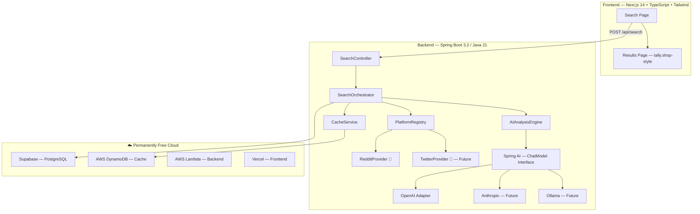

# CrowdLens — Implementation Plan

> *Real People, Real Opinions* — A platform-agnostic search engine that aggregates authentic user opinions from social platforms and uses AI to produce structured, actionable analysis.

---

## Project Description

CrowdLens searches Reddit (and future platforms) for authentic user opinions on any product, service, or experience. Unlike traditional search engines that surface SEO-optimized or sponsored content, CrowdLens taps into anonymous, unbiased discussions from real people. It then uses AI to distill hundreds of posts into a structured analysis page — inspired by [tally.shop](https://tally.shop) — with category ratings, sentiment breakdowns, curated testimonials, and an overall verdict.

---

## Key Features

| Feature | Description |
|---------|-------------|
| **🔍 Intelligent Search** | Natural language search across Reddit (extensible to Twitter, HN, etc.) |
| **🤖 AI-Powered Analysis** | GPT-4o-mini (swappable) produces structured ratings, summaries, and verdicts |
| **📊 Category Breakdown** | Auto-detects relevant categories (e.g., Efficacy, Safety, Value) with Fair/Excellent ratings |
| **💬 Curated Testimonials** | Selects representative Reddit quotes with sentiment labels (Positive/Neutral/Negative) |
| **👤 Persona Matching** | "Is this right for you?" — AI-generated pros/cons for different user types |
| **🔌 Platform Plugins** | Add new social platforms (Twitter, HN) without modifying core logic |
| **🧠 Model-Agnostic AI** | Swap OpenAI → Anthropic → Gemini → Ollama via config, zero code changes |
| **⚡ Smart Caching** | DynamoDB TTL cache — identical queries never hit Reddit or AI twice |
| **🛡️ Anti-Ban Stealth** | Token bucket, exponential backoff, UA rotation, request jitter |
| **📈 Incremental Cursor** | Avoids duplicate data, minimizes bandwidth — inspired by [Matiks Monitor](https://github.com/Krishnav1237/Social-Media-Brand-Monitoring/blob/main/docs/02_SCRAPING_INTELLIGENCE_AND_STRATEGY.md) |

---

## Architecture Overview



---

## AI Provider Abstraction (Model-Agnostic)

Uses **Spring AI** — swap models by changing one config property + Maven dependency:

| Model | Config Property | Dependency |
|-------|----------------|------------|
| OpenAI GPT-4o-mini | `spring.ai.openai.chat.options.model=gpt-4o-mini` | `spring-ai-openai-spring-boot-starter` |
| Anthropic Claude | `spring.ai.anthropic.chat.options.model=claude-3-haiku` | `spring-ai-anthropic-spring-boot-starter` |
| Google Gemini | `spring.ai.vertex-ai.chat.options.model=gemini-pro` | `spring-ai-vertex-ai-gemini-spring-boot-starter` |
| Local Ollama | `spring.ai.ollama.chat.options.model=llama3` | `spring-ai-ollama-spring-boot-starter` |

---

## Anti-Ban & Rate Limiting Strategy

| Measure | Implementation |
|---------|---------------|
| **Token Bucket** | Bucket4j: 60 req/min (API), 20 req/min (JSON scraper) |
| **Exponential Backoff** | On 429: 2s → 4s → 8s → 16s → 32s → 60s cap |
| **User-Agent Rotation** | Pool of 10+ browser-like UA strings, rotated per request |
| **Request Jitter** | Random 500–2000ms delay between requests |
| **Aggressive Caching** | DynamoDB: 24h TTL — identical queries never hit Reddit or AI twice |
| **Circuit Breaker** | Resilience4j: open after 5 failures/60s, 30s recovery wait |
| **Incremental Cursor** | Track "high water mark" per query — skip already-seen posts |
| **Data Filtering** | Remove deleted, AutoModerator, bots, min 20-char content |

---

## Database Schema (Platform-Agnostic)

```sql
CREATE TABLE search_results (
    id UUID PRIMARY KEY DEFAULT gen_random_uuid(),
    query VARCHAR(500) NOT NULL,
    query_normalized VARCHAR(500) NOT NULL,
    overall_score INTEGER,
    overall_verdict TEXT,
    analysis JSONB NOT NULL,
    source_platforms TEXT[],              -- ['reddit', 'twitter']
    post_count INTEGER,
    created_at TIMESTAMP DEFAULT NOW(),
    expires_at TIMESTAMP DEFAULT NOW() + INTERVAL '7 days'
);

CREATE TABLE social_posts (
    id UUID PRIMARY KEY DEFAULT gen_random_uuid(),
    platform VARCHAR(50) NOT NULL,       -- 'reddit', 'twitter', 'hackernews'
    platform_id VARCHAR(100) UNIQUE NOT NULL,
    search_result_id UUID REFERENCES search_results(id),
    source VARCHAR(200),                 -- subreddit, hashtag, etc.
    title TEXT,
    body TEXT,
    score INTEGER,
    permalink VARCHAR(500),
    posted_at TIMESTAMP,
    scraped_at TIMESTAMP DEFAULT NOW()
);
```

---

## Frontend — Minimal, Modular, Scalable UI

**Approach**: Clean, functional UI using Tailwind CSS utility classes. Basic now, designed to be progressively enhanced.

**Sections** (tally.shop-inspired):
1. **Search Home** — Centered search bar, tagline, recent searches
2. **Header** — Query name + score circle (0-100) + verdict label
3. **AI Verdict** — 2-3 sentence summary card
4. **"Is this right for you?"** — Persona pros/cons
5. **Category Deep-Dive** — Sidebar tabs (Composition/Efficacy/Safety/Value) + AI summary per category
6. **Testimonial Cards** — Reddit quotes with sentiment badges (green/gray/red)
7. **Data Transparency** — "Based on X posts from Y subreddits"

---

## Cloud Stack — $0/month Forever

| Layer | Service | Always-Free Limits |
|-------|---------|-------------------|
| **Backend** | AWS Lambda + API Gateway | 1M req/mo, 400K GB-sec |
| **Database** | Supabase (managed PostgreSQL) | 500MB, 50K MAU |
| **Cache** | AWS DynamoDB | 25GB storage, 200M req/mo |
| **Frontend** | Vercel | Unlimited hobby deploys |

> [!TIP]
> **Why DynamoDB over Redis/Upstash?** DynamoDB's always-free tier (25GB, 200M req/mo) is vastly more generous than Upstash (256MB, 10K cmd/day). It's an AWS-native service, so zero extra vendor. We use it as a TTL-based key-value cache — `queryHash → analysisJSON` with auto-expiry.

---

## Tech Stack

| Layer | Technology |
|-------|-----------|
| **Backend** | Java 17, Spring Boot 3.2, Maven |
| **Frontend** | Next.js 14 (App Router), TypeScript, Tailwind CSS v4 |
| **Database** | PostgreSQL 16 (Supabase managed) |
| **Cache** | DynamoDB (TTL-based key-value) |
| **AI** | Spring AI (model-agnostic: OpenAI, Anthropic, Gemini, Ollama) |
| **Rate Limiting** | Bucket4j |
| **Resilience** | Resilience4j (circuit breaker) |
| **API Docs** | SpringDoc OpenAPI (Swagger UI) |
| **Local Dev** | Docker Compose (Postgres + DynamoDB Local + Backend + Frontend) |

---

## Reddit Auth — Script Type

```properties
# .env — your Reddit "script" app credentials
REDDIT_CLIENT_ID=your_client_id
REDDIT_CLIENT_SECRET=your_client_secret
REDDIT_USERNAME=your_reddit_username  
REDDIT_PASSWORD=your_reddit_password
REDDIT_USER_AGENT=crowdlens:v1.0.0 (by /u/your_username)
```

> [!WARNING]
> **Create a dedicated Reddit account** for CrowdLens. Register a fresh "script" app on it. This isolates your personal account. With our rate limiting (60 req/min, well under 100 QPM limit) and read-only access, account suspension risk is near zero.

---

## Project Structure

```
crowdlens/
├── frontend/                          # Next.js 14 + Tailwind CSS
│   ├── src/app/
│   │   ├── page.tsx                   # Search home
│   │   ├── search/[query]/page.tsx    # Results
│   │   └── layout.tsx
│   ├── src/components/                # Minimal, modular, scalable
│   ├── Dockerfile
│   └── tailwind.config.ts
│
├── backend/                           # Spring Boot 3.2
│   ├── src/main/java/com/crowdlens/
│   │   ├── CrowdLensApplication.java
│   │   ├── config/                    # DynamoDB, AI, Reddit, RateLimit, OpenAPI
│   │   ├── controller/
│   │   │   ├── SearchController.java
│   │   │   ├── HealthController.java
│   │   │   └── GlobalExceptionHandler.java
│   │   ├── service/
│   │   │   ├── SearchOrchestrator.java
│   │   │   ├── AIAnalysisEngine.java
│   │   │   ├── PromptBuilder.java
│   │   │   └── CacheService.java     # DynamoDB-backed
│   │   ├── provider/                  # 🔌 Platform plugins
│   │   │   ├── PlatformProvider.java
│   │   │   ├── PlatformRegistry.java
│   │   │   └── reddit/
│   │   │       ├── RedditProvider.java
│   │   │       ├── RedditApiClient.java
│   │   │       ├── RedditJsonScraper.java
│   │   │       ├── RedditDataAggregator.java
│   │   │       └── RedditRateLimiter.java
│   │   ├── model/                     # DTOs + JPA entities
│   │   └── repository/               # Spring Data JPA
│   ├── pom.xml
│   └── Dockerfile                     # Multi-stage build (Maven + JRE)
│
├── docker-compose.yml                 # Local: Postgres + DynamoDB Local + Backend + Frontend
├── .env.example
└── README.md
```

---

## Phases — Local First, Cloud Later

### Phase 1 — Backend Foundation (Local Docker) ✅
1. Spring Boot 3.2 project init (Java 17, Maven)
2. Docker Compose: PostgreSQL + DynamoDB Local + Spring Boot (multi-stage Dockerfile)
3. Reddit OAuth2 client (script-type auth) + `.json` fallback
4. Token bucket rate limiting (Bucket4j) + circuit breaker (Resilience4j)
5. `PlatformProvider` interface + `PlatformRegistry` + `RedditProvider`
6. `RedditDataAggregator` (dedup, filter bots/deleted/AutoMod)
7. Database schema (JPA entities + Flyway migrations)

### Phase 2 — AI Analysis Pipeline (Local) ✅
8. Spring AI integration (OpenAI, model-agnostic)
9. `PromptBuilder` with query-type auto-detection + dynamic categories
10. `CacheService` with DynamoDB Local
11. `SearchOrchestrator` (end-to-end pipeline)
12. REST endpoints: `POST /api/search`, `GET /api/health`
13. API documentation: SpringDoc OpenAPI (Swagger UI at `/swagger-ui.html`)

### Phase 3 — Frontend (Minimal, Modular)
13. Next.js 14 + TypeScript + Tailwind CSS v4
14. Search home page (clean, centered search bar)
15. Analysis results page (modular component structure)
16. API client + loading/error states
17. Basic but extensible component library

### Phase 4 — Cloud Deployment
18. AWS Lambda packaging (Spring Cloud Function)
19. Supabase PostgreSQL + DynamoDB production setup
20. Vercel frontend deploy
21. README with full setup guide

---

## Verification Plan

```bash
# Phase 1
docker compose up                          # All services start
curl localhost:8080/api/health             # Backend healthy

# Phase 2
curl -X POST localhost:8080/api/search \
  -H "Content-Type: application/json" \
  -d '{"query": "creatine supplement"}'    # Full analysis returned

# Phase 3
open http://localhost:3000                 # Search UI works end-to-end

# Phase 4
curl https://your-lambda-url/api/health   # Cloud deploy works
```

---

> [!NOTE]
> **Full architecture details** (design principles, patterns, HLD, LLD, class diagrams, sequence diagrams, scraping intelligence) are in the companion [architecture.md](file:///Users/Anubhav.Bagri/.gemini/antigravity/brain/51231a21-1ac4-449f-a4ac-278a9ddcdcc3/architecture.md) document.
